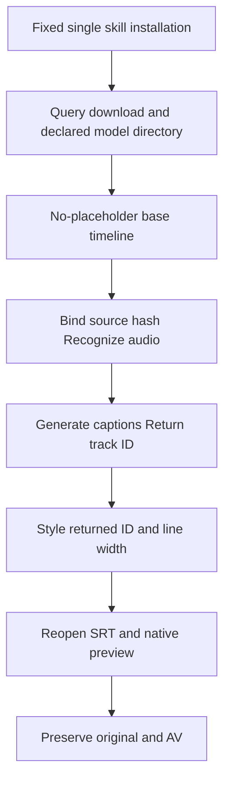

# First-use caption handoff after actual ASR

FilmCraft source37 adds asr-short-film.json without placeholder captions and asr-captions-revision.json. All13 standalone skills include both templates and the guide. Film40 pins this source; the native runtime stayscraft.4. Historical fixed identities and assets remain unchanged.

The regression first reproduced two visible tracks. A fresh public model download and actual English recognition then passed with one caption track, three segments, maxChars32 and size84. The28 recognized words and reference-word set coverage1.0 are not WER or multilingual quality. Original project and audio/video remain intact. The native preview was inspected; human creative acceptance is NOT_RUN. Source regression:169 tests,134 passed,35 conditional skips.

Use the loaded skill directory to bootstrap and query models, then download into a declared data-dir. Adapt the ASR base timeline to actual media duration and save the base delivery. Copy the revision template into the task, replace the zero digest with the actual base manifest project hash and pass the same model directory plus a new output directory. Style the returned speechCaptions.track ID, not a guessed C1. Size84 gives nominal14px at180 height; recalculate for changed fonts, languages or dimensions and inspect the preview.

For existing projects, query every caption track and disable only an explicitly superseded placeholder. Save separately and preserve its text/time and unrelated user captions. Layout-only changes reuse recognized words. Reconcile failures or unknown outcomes before replaying writes.

[Bounded evidence](evidence/asr-caption-handoff-first-use-20261008.json). New fixed-host/native acceptance is separate. Full V1, generic Skills CLI, every command context, other platforms and human creative acceptance remain open.
