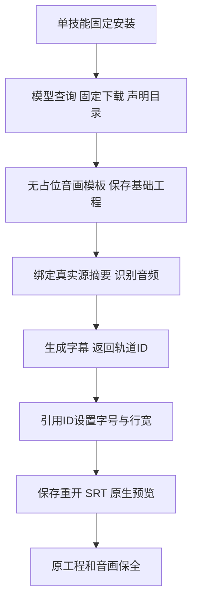

# 真实ASR字幕首用交接

FilmCraft source37新增无占位字幕的asr-short-film.json与asr-captions-revision.json，13项独立技能各自包含两模板与指南。Film40锁定此源；原生运行时仍为craft.4。旧固定版继续保留原身份与制品。

真实回归先复现旧流程两条可见字幕轨道，随后以首次公开模型下载、实际英文音频识别验证新模板：单一字幕轨道、3段字幕、maxChars32、size84；28个词和参考词集合覆盖1.0不是WER或跨语言质量。原工程与音画保持。实际原生预览已查看，人工创作验收未执行。源码169项中134通过、35条件跳过。

先从实际加载技能目录调用bootstrap和CLI核对模型，下载到声明的data-dir。按媒体长度修改asr-short-film时间线，保存基础交付；复制ASR修订模板到任务目录，用基础manifest的真实工程摘要替换全零值，指定同一模型目录和新输出。字幕样式引用speechCaptions.track返回ID，不猜测C1。180高默认size84为名义14px；变更字体、语言、尺寸时重新计算并看预览。

已有用户工程先查询全部字幕轨道；只关闭任务明确替换的占位轨道，另存并保留文本和时间。不要自动关闭用户字幕。版式调整复用已识别词。失败或未知结果先检查原任务，不自动重放写入。

[限定证据](evidence/asr-caption-handoff-first-use-20261008.json)。新固定宿主安装与原生执行仍需另验，完整V1、通用Skills CLI、所有命令上下文、其他平台和人工创作验收未关闭。
