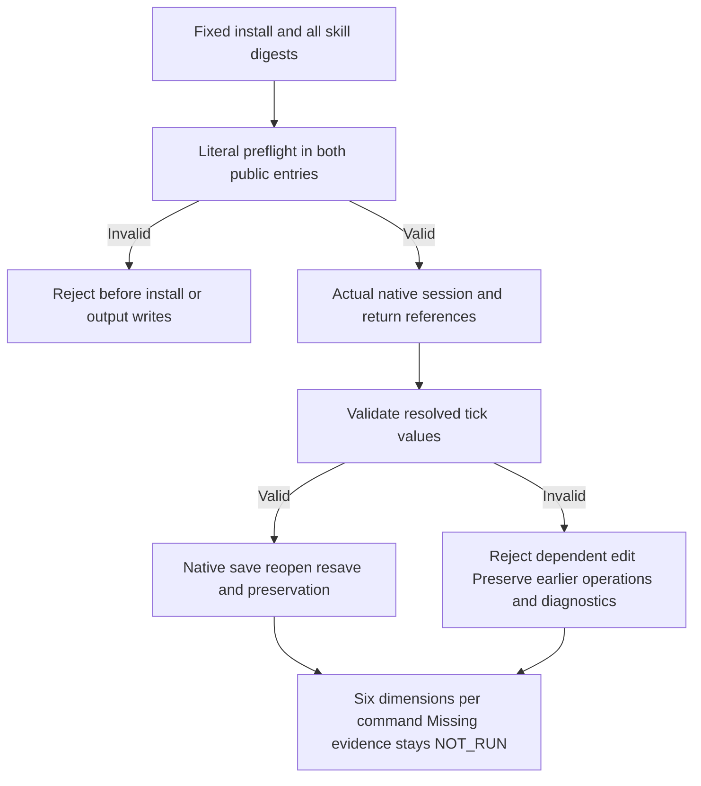

# FilmCraft Fixed Command Entry and Dimension Evidence

[中文](FilmCraft-Command-Parity.zh_CN.md). Authoritative scenarios: FC-CM-001-ENTRY-TICK-PARITY, FC-CM-001-RESOLVED-TICK and FC-CM-001-COMMAND-EVIDENCE; [task 9.3](../openspec/changes/establish-v1-plugin/tasks.md).

## Fixed installation acceptance

The [report](evidence/filmcraft44-command-parity-20261008.json) is PASS and task 9.3 is complete. Tests use the actual Codex installation of public plugin dev.44 / `fc03fe9b8af0ef314dde9e6b8c7ae6da9ed22f04`, pinned to skills dev.41 / `f47a2ff6e47e64767d82fd8d88ffa225b204879e`. CLI craft.4 / `80dfc579f7639dc1d182c4dc9ab9cd834beaa234e6144e664757d40632f36893` runs on darwin-arm64 in headless mode.

- All 13 skills' public commands/workflow CLIs reject 364 invalid literal tick cases and 26 wrong plan-entry cases. Inputs and unrelated files remain unchanged; runtime and output directories are not created.
- Across both entries, 1494 parameter cases cover documented tick fields in 74 commands. Numeric strings, booleans, floats and signed overflow are rejected; valid signed 64-bit integers retain precision. Other parameter types, required fields and exhaustive native contexts are not qualified. Seven whole-parameter result cases exposed two incorrect successes and five TypeErrors in the source regression. Resolved non-object parameters now fail structurally; actual return references verify the fix in the new installed snapshot.
- Six real-session reference cases use a name returned by `sequence.inspect` as an invalid tick. Both entries refuse dependent multicam, nested transcript or whole-parameter reference edits before submission; later saves do not occur. Earlier valid operations and failure diagnostics are preserved, as are original projects and inputs.
- Actual per-media transcripts saved by both native entries retain `9007199254740993`. The commands entry also reopens and resaves natively, comparing the original transcript. Explicit conversion from domain decimal-string timing is checked separately. All 13 installed skill hashes remain unchanged.

`transcript.inspect` is an audio-track-derived view: an empty video-matte view cannot establish raw transcript precision. Native `.fcproj` files are JSON; tests inspect actual saved content and compare it after native reopen/resave. Only `selection`, already documented as session state, is excluded from sequence persistence comparison. Every other sequence field is compared. The two verifier fixture corrections and their original failure logs are retained, rather than described as product defect red tests.

## Per-command matrix

The [666-row machine matrix](evidence/filmcraft44-command-parity-20261008/command-matrix.json) binds each command's parameter digest. Dimensions share the report's immutable plugin/source, runtime, platform and mode identity.

| Dimension | PASS | NOT_RUN | Scope |
| :--- | ---: | ---: | :--- |
| Discovery | 666 | 0 | Actual empty-session registry and matching parameter text |
| Parameter validation | 74 | 592 | Documented tick types, ranges and precision only |
| Positive execution | 12 | 654 | Actual command replies during create/edit/save/reopen |
| Negative rejection | 74 | 592 | Adapter tick preflight in both entries, not all native context errors |
| Reopen | 6 | 660 | Persisted sequence settings, placement, speed, transition and raw transcript |
| Non-target preservation | 6 | 660 | Original project/input preservation during these reopen/failure cases |

N/A requires a specific reason; missing tests are not relabeled N/A. Discovery counts, representative execution counts and complete command acceptance remain separate. Exhaustive command, bridge/GUI, other-platform and complete V1 gates remain open; `completeCommandAcceptance` stays NOT_PROVEN.



## Reproduction and evidence limits

```bash
python3 -I -B scripts/verify_command_parity.py --host "$FIXED_HOST_OUTPUT" --authority "$ARTCRAFT_REPOSITORY" --ref v0.1.0-dev.44 --output "$NEW_PARITY_OUTPUT"
python3 -I -B -m unittest discover -s tests -p test_command_evidence.py -v
```

The verifier reads installed content and checks manifest, source, all skills and executable files against immutable tag objects. Output must be new; private host directory maps are not committed. QA producers and matrix tests are included in the fixed dev.44 tag and ZIP, with recorded digests; acceptance records and this explanation are post-release main additions. The frozen tag stays unchanged. Native requests/replies, plans, input/artifact digests, individual cases and raw test logs remain linked.

Six matrix tests went red to green. The source regression has 172 passing tests and 36 conditional skips out of 208; all 42 plugin Python tests pass. Skipped tests do not count as native acceptance. Automatic model routing, quality/user acceptance, other modes/platforms and full V1 are not qualified by these results.
