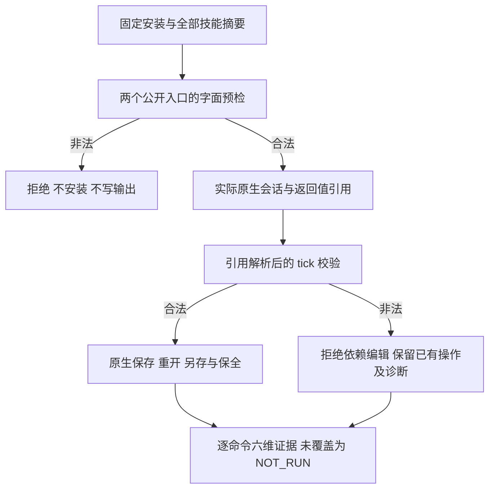

# FilmCraft 固定命令入口与分维证据

[English](FilmCraft-Command-Parity.md)。正式合同为 FC-CM-001-ENTRY-TICK-PARITY、FC-CM-001-RESOLVED-TICK、FC-CM-001-COMMAND-EVIDENCE；对应 [任务 9.3](../openspec/changes/establish-v1-plugin/tasks.md)。

## 固定安装验收

[报告](evidence/filmcraft44-command-parity-20261008.json) 为 PASS，任务 9.3 已完成。被测对象是公开插件 dev.44 / `fc03fe9b8af0ef314dde9e6b8c7ae6da9ed22f04` 的实际 Codex 安装内容，锁定技能源 dev.41 / `f47a2ff6e47e64767d82fd8d88ffa225b204879e`；原生 CLI craft.4 / `80dfc579f7639dc1d182c4dc9ab9cd834beaa234e6144e664757d40632f36893`，darwin-arm64、headless。

- 13 技能的公开 commands / workflow CLI 共 364 个非法字面 tick 用例及 26 个错计划入口用例被拒绝，输入与无关文件保全，未创建运行时或输出目录。
- 两入口共 1494 个参数用例，覆盖目录中 74 条命令声明的 tick 字段：数字字符串、布尔、浮点、上下溢出被拒绝，合法有符号 64 位整数保留精度。此结果不证明其他类型、必填项或全部原生上下文的参数验收。新增 7 种整体参数解析结果的源回归修复了 2 个错误通过和 5 个 TypeError；解析后非对象参数现在结构化拒绝，新固定安装用真实返回引用复验。
- 6 个真实会话引用用例使用 `sequence.inspect` 返回的名称作为非法 tick；两入口在 multicam、嵌套 transcript 或整体参数引用的依赖编辑提交前拒绝，后续保存未发生。此前合法操作和失败诊断保留，原工程及输入不变。
- 两入口实际原生保存的逐媒体 transcript 保留 `9007199254740993`；commands 入口还原生重开再另存并比较原始 transcript。领域十进制字符串的显式转换单独核验。13 项安装技能的完整摘要保持不变。

`transcript.inspect` 展示音轨映射后的派生视图，不能用空的视频色板词条视图判定原始时间精度。原生 `.fcproj` 为 JSON，本验收读取实际保存内容，再经原生重开另存比较。`selection` 是已有合同明确的会话字段；仅此字段从时间线持久化比较排除，其他字段全部比较。两次验收脚本 fixture 修正和原始失败日志保留于报告中，不当作产品缺陷红灯。

## 逐命令矩阵

[666 项机器矩阵](evidence/filmcraft44-command-parity-20261008/command-matrix.json) 的每行独立绑定命令参数摘要，各维度共享报告中的固定运行时、平台、模式和插件/技能源身份。

| 维度 | PASS | NOT_RUN | 范围 |
| :--- | ---: | ---: | :--- |
| 发现 | 666 | 0 | 当前真实空会话目录及参数原文一致 |
| 参数验证 | 74 | 592 | 仅声明的 tick 类型、范围和精度 |
| 正向执行 | 12 | 654 | 原生创建、编辑、保存与重开的实际命令回复 |
| 负向拒绝 | 74 | 592 | 两入口适配器的非法 tick 预检，非全部原生状态错误 |
| 保存重开 | 6 | 660 | 序列设置、放置、速度、转场及原始 transcript 的持久化 |
| 非目标保全 | 6 | 660 | 上述场景重开及失败后的原工程与输入保全 |

N/A 必须有具体理由；本矩阵未把缺失测试改成 N/A。发现数量、代表命令执行数量、逐命令完整验收分别统计，不能合成一个“可用率”。完整逐命令、bridge/GUI、其他平台和完整 V1 保持开放，`completeCommandAcceptance` 仍为 NOT_PROVEN。



## 复验与证据边界

```bash
python3 -I -B scripts/verify_command_parity.py --host "$FIXED_HOST_OUTPUT" --authority "$ARTCRAFT_REPOSITORY" --ref v0.1.0-dev.44 --output "$NEW_PARITY_OUTPUT"
python3 -I -B -m unittest discover -s tests -p test_command_evidence.py -v
```

复验读取已安装副本，并从不可变标签核对 manifest、技能源、全部技能及执行文件。输出必须为新目录，私有宿主目录清单不提交。QA 生产者及矩阵测试已包含于固定 dev.44 标签与 ZIP，摘要写入报告；本次验收记录和说明为发布后的 main 补充，冻结标签不移动。原生请求/回复、计划和输入产物摘要、逐案例验证及原始测试日志均关联保存。

矩阵生成器 6 项由红转绿；源回归 208 项中 172 通过、36 条件跳过；插件 Python 42 项通过。跳过项不冒充真实运行验收。模型路由、质量/用户接受、其他模式/平台和完整 V1 没有因此获得通过。
