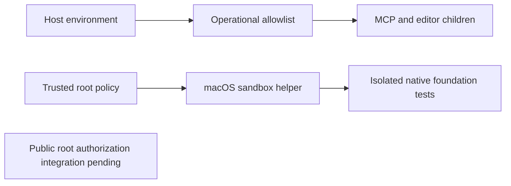

# Execution permission foundation

Source52 uses an allowlist for MCP/editor child environments: PATH, HOME, TMPDIR, LANG, LC_ALL, LC_CTYPE and an absolute FILMCRAFT_DATA_DIR. Host keys, credential-bearing proxy configuration and interpreter injection variables are excluded. Explicit trusted Session environment overrides remain an internal API.

The directory-policy helper validates canonical existing roots and constructs an actual macOS sandbox command. Unsupported systems refuse this helper. Tests cover outside reads/writes, read-only inputs, parent symlink replacement and preserved executable roots.

The public workflow does not yet consume this root policy; the helper alone is not complete permission enforcement. Binding roots into host authorization, integrating all native paths and separating maintenance permissions remain open under FC-RL-002. No full V1, marketplace, other-platform or secret-reference acceptance is claimed.

Plugin69 additionally filters plan normalization, native preflight, workflow execution and process identity probes. A real Harness observer test detected inherited secrets in fixed68 and verifies their absence in the candidate, with native save/reopen and a linked receipt. This is candidate evidence, not fixed69 host qualification. Eight full tasks remain open.
