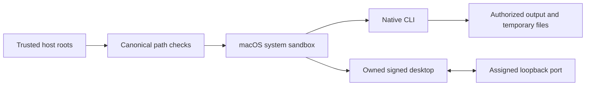

# Execution permissions / 执行权限

Public workflow, full-command run and owned desktop execution require independently supplied canonical read/write roots. Native children run in the macOS system sandbox; inputs, skill code and runtime caches remain protected, and the owned desktop bridge has only its assigned loopback port. The desktop and MCP share an authorized temporary directory for rendered frames. Actual candidate native and signed-desktop checks pass; full FC-RL-002, fixed-host qualification and eight V1 tasks remain open.

The trusted maintenance installer remains outside the native sandbox and requires an explicit runtime-home write grant. Unsupported systems refuse public execution; no sandbox bypass fallback is used. Low-level Python APIs are internal trusted interfaces. Native parameter registries, secret-reference contracts and maintenance separation still require full acceptance.

dev.70 binds trusted execution roots into exact host authorization and native preflight. Public workflow and recovery continuation accept an independent permissions file; changed roots invalidate the grant. Source53 isolates native and owned desktop execution, including its loopback port and temporary frame files. Actual candidate native and signed-desktop checks pass. Complete FC-RL-002, maintenance separation, secret references and eight V1 tasks remain open; fixed70 host qualification is NOT_RUN.

`workflow.ts run --permissions FILE` and `recovery.ts continue --permissions FILE` bind `filmcraft-execution-permissions/v1` independently of plan content. `readRoots` and `writeRoots` must contain existing canonical directories. A digest is retained in task binding and the authorization subject. Public execution refuses a missing policy; old task references do not grant roots. Runtime maintenance probes and complete native parameter contracts remain separate audit work.

dev.71 requires independent read/write roots for runtime maintenance probes and selection. Canonical roots are bound into both exact host grants; missing roots and outside plan/cache paths refuse before plan reads or authorization. Native capability probes receive the same sandbox policy. Actual public CLI probes/activation, expanded-root refusal, grant revocation and input/skill/binary preservation pass as candidate evidence. Full FC-RL-002 and eight V1 tasks remain open; fixed71 installed-host qualification is NOT_RUN.

Fixed dev.71 installed verification:13 skills load in isolated Codex0.147.0,185 installed tests pass without skips,26 public native root cases and17 owned signed-desktop operations pass, with code/test/skill identities preserved. This is bounded evidence. A separate complete-command read-only model probe FAILS: an existing explicit whisper-tiny cache is overridden by the private output data directory and reported missing. Full permissions and command qualification remain NOT_PROVEN; eight tasks remain open. [Current evidence](evidence/filmcraft71-fixed-boundaries-20261009/report.json).

dev.72 pins published source54, preserving the explicit read-only model directory for complete-command, owned desktop and MCP execution. Four target regressions and actual CLI Whisper inference (28 words, unchanged model hashes) pass. The official signed desktop discovers the same cache but reports speech unavailable and correctly refuses inference. Full FC-RL-002, fixed72 qualification and eight V1 tasks remain open. [Evidence](evidence/source54-readonly-model-20261009/report.json).

dev.73 pins published source56, enforcing trusted roots and filtered child environments at the legacy raw CLI. Model download has a separate validated maintenance mode with data-directory-only writes and outbound-only network permission. Three target reds become six passes;39 actual raw entry cases, cold model download/28-word recognition/reopen/SRT and thirteen independently copied candidate skill tasks pass. Fixed72 evidence remains version-bound, including185 installed native tests and all1775 frozen files preserved. Full host intent routing, permission/command qualification and eight V1 tasks remain open; fixed73 qualification is NOT_RUN. [Evidence](evidence/filmcraft56-raw-launcher-candidate-20261009/report.json).
