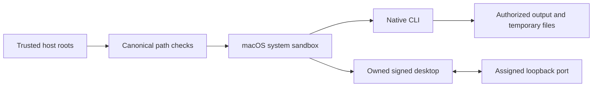

# Execution permissions / 执行权限

Public workflow, full-command run and owned desktop execution require independently supplied canonical read/write roots. Native children run in the macOS system sandbox; inputs, skill code and runtime caches remain protected, and the owned desktop bridge has only its assigned loopback port. The desktop and MCP share an authorized temporary directory for rendered frames. Actual candidate native and signed-desktop checks pass; full FC-RL-002, fixed-host qualification and eight V1 tasks remain open.

The trusted maintenance installer remains outside the native sandbox and requires an explicit runtime-home write grant. Unsupported systems refuse public execution; no sandbox bypass fallback is used. Low-level Python APIs are internal trusted interfaces. Native parameter registries, secret-reference contracts and maintenance separation still require full acceptance.

dev.70 binds trusted execution roots into exact host authorization and native preflight. Public workflow and recovery continuation accept an independent permissions file; changed roots invalidate the grant. Source53 isolates native and owned desktop execution, including its loopback port and temporary frame files. Actual candidate native and signed-desktop checks pass. Complete FC-RL-002, maintenance separation, secret references and eight V1 tasks remain open; fixed70 host qualification is NOT_RUN.

`workflow.ts run --permissions FILE` and `recovery.ts continue --permissions FILE` bind `filmcraft-execution-permissions/v1` independently of plan content. `readRoots` and `writeRoots` must contain existing canonical directories. A digest is retained in task binding and the authorization subject. Public execution refuses a missing policy; old task references do not grant roots. Runtime maintenance probes and complete native parameter contracts remain separate audit work.
