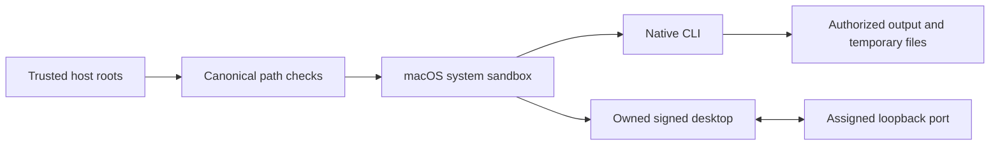

# Execution permissions / 执行权限

公开工作流、完整命令执行和所属桌面执行要求独立提供真实读写根；原生子进程使用macOS系统沙箱，保护输入、技能代码与运行时缓存，所属桌面桥仅开放分配的本地端口。桌面与MCP共用授权临时目录以生成渲染帧。实际候选原生和签名桌面检查通过；完整FC-RL-002、固定宿主验收及八项V1任务仍开放。

The trusted maintenance installer remains outside the native sandbox and requires an explicit runtime-home write grant. Unsupported systems refuse public execution; no sandbox bypass fallback is used. Low-level Python APIs are internal trusted interfaces. Native parameter registries, secret-reference contracts and maintenance separation still require full acceptance.

dev.70将可信执行根绑定到精确宿主授权与原生预检；公开工作流和恢复继续入口接收独立权限文件，根策略变化后旧授权失效。source53隔离原生及所属桌面执行，包含本地桥端口和临时渲染文件。实际候选原生与签名桌面检查通过；完整FC-RL-002、维护权限分离、秘密引用及八项V1任务仍开放，固定70宿主验收为NOT_RUN。

`workflow.ts run --permissions FILE` and `recovery.ts continue --permissions FILE` bind `filmcraft-execution-permissions/v1` independently of plan content. `readRoots` and `writeRoots` must contain existing canonical directories. A digest is retained in task binding and the authorization subject. Public execution refuses a missing policy; old task references do not grant roots. Runtime maintenance probes and complete native parameter contracts remain separate audit work.

dev.71要求运行时维护探测与选择提供独立读写根，规范根摘要进入探测和选择的精确宿主授权；缺少策略及计划／缓存越界在计划读取和授权查询前拒绝，原生能力探测沿用同一沙箱策略。实际公开CLI探测／激活、根扩张拒绝、撤销授权及输入／技能／二进制保全通过候选验证。完整FC-RL-002与八项V1任务保持开放，固定71宿主安装验收为NOT_RUN。

固定dev.71安装核验：隔离Codex0.147.0加载13技能，185项安装回归零跳过通过，26项公开原生根边界及17项所属签名桌面操作通过，执行代码／测试／技能身份保全。该证据仅覆盖上述范围。另行只读模型探测实际FAIL：完整命令入口用输出私有目录覆盖已声明的whisper-tiny缓存并误报缺失。完整权限及命令资格仍为NOT_PROVEN，八项任务保持开放。[当前证据](evidence/filmcraft71-fixed-boundaries-20261009/report.json)。

dev.72锁定公开source54：完整命令、所属桌面和MCP保留显式只读模型目录。四项目标回归及CLI真实Whisper识别通过（28词，模型摘要不变）；官方签名桌面发现同一缓存，但报告语音能力不可用并正确拒绝推理。完整FC-RL-002、固定72验收及八项V1任务保持开放。 [Evidence](evidence/source54-readonly-model-20261009/report.json).

dev.73锁定已发布source56：旧原生CLI强制可信根并过滤子进程环境；模型下载采用独立校验的维护模式，仅可写指定数据目录并使用网络出站。三项目标红灯转六项通过；39项真实原生入口、模型冷下载／28词识别／重开／SRT及十三个独立复制技能候选业务通过。固定72补证保留原版本身份，包括185项安装原生回归与1775文件保全。宿主意图路由、完整权限／全命令及八项V1任务仍开放；固定73验收NOT_RUN。 [Evidence](evidence/filmcraft56-raw-launcher-candidate-20261009/report.json).

dev.74锁定已发布源57：完整命令、领域native.command与旧exec共用固定原生顶层参数校验；未知字段在素材读取、安装和创建输出前拒绝且不回显名称／值，别名、联合参数与整体结果引用保留。241项源码、39项公开入口拒绝、39项原生根边界及十三候选真实业务通过。固定73完成185项安装原生回归与1793文件保全，但原未定义参数红灯保留。固定74与完整权限、命令上下文及宿主意图路由仍待，八项V1任务保持未完成。 [Evidence](evidence/filmcraft-native-parameter-fields-20261009/report.json).

固定75补证：十三技能的commands／desktop／raw入口共117项越界、相对路径和控制字符模型引用拒绝；52精确原生发现通过，52追加工程参数请求在无授权时安装前拒绝，13真实缺模型准入在任何编辑步骤前拒绝。固定74的只读缓存推理／摘要保全及签名桌面发现／缺能力拒绝，仅在源57全部技能、Harness源码和三个执行辅助文件与固定75逐字节一致后复用。READONLY-MODELS场景通过；完整秘密引用消费者、其他权限场景及7.4—7.6仍开放，不虚构凭据服务。见[逐场景索引](evidence/fc-rl-002/index.json)。

固定75维护补证：十三个安装公开CLI入口在安装前拒绝130项畸形、混合编辑或未授权维护请求；26个实际macOS沙箱子进程验证数据目录允许写入、根外／保护目录拒写、普通编辑禁止联网及维护出站连接本机受控服务通过。两轮均通过，1826个固定安装文件与发布标签完全一致。可复验脚本位于main，不属于未改动的dev.75安装包；本补证不替代既有实际原生命令证据，完整权限及命令上下文任务仍开放。见[证据](evidence/filmcraft75-maintenance-boundaries-20261009.json)。

dev.76在维护候选、账本及探测回执打开前检查读取根，激活／回滚在解析回执及授权前检查账本写入根；只读主题／探测保持可用。固定75真实修改只读账本的行为红灯已复现，候选拒绝且保全账本，正常原生维护仍通过。13项目标测试通过；固定76及完整权限验收仍开放。见[证据](evidence/maintenance-path-roots-candidate-20261009/report.json)。
