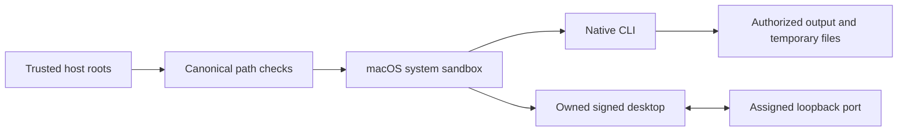

# Execution permissions / 执行权限

公开工作流、完整命令执行和所属桌面执行要求独立提供真实读写根；原生子进程使用macOS系统沙箱，保护输入、技能代码与运行时缓存，所属桌面桥仅开放分配的本地端口。桌面与MCP共用授权临时目录以生成渲染帧。实际候选原生和签名桌面检查通过；完整FC-RL-002、固定宿主验收及八项V1任务仍开放。

The trusted maintenance installer remains outside the native sandbox and requires an explicit runtime-home write grant. Unsupported systems refuse public execution; no sandbox bypass fallback is used. Low-level Python APIs are internal trusted interfaces. Native parameter registries, secret-reference contracts and maintenance separation still require full acceptance.

dev.70将可信执行根绑定到精确宿主授权与原生预检；公开工作流和恢复继续入口接收独立权限文件，根策略变化后旧授权失效。source53隔离原生及所属桌面执行，包含本地桥端口和临时渲染文件。实际候选原生与签名桌面检查通过；完整FC-RL-002、维护权限分离、秘密引用及八项V1任务仍开放，固定70宿主验收为NOT_RUN。

`workflow.ts run --permissions FILE` and `recovery.ts continue --permissions FILE` bind `filmcraft-execution-permissions/v1` independently of plan content. `readRoots` and `writeRoots` must contain existing canonical directories. A digest is retained in task binding and the authorization subject. Public execution refuses a missing policy; old task references do not grant roots. Runtime maintenance probes and complete native parameter contracts remain separate audit work.
