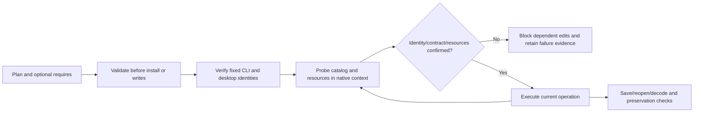

# FilmCraft Fixed-install Capability Acceptance

[中文](FilmCraft-Fixed-Capabilities.zh_CN.md). [FC-RT-002](../openspec/changes/establish-v1-plugin/specs/runtime-distribution/spec.md) remains authoritative. The [acceptance record](evidence/filmcraft44-fixed-capabilities-20261008.json) completes task 9.12. Full isolated upgrade, draining, fallback and state-schema compatibility remain open under 2.4—2.6.

Verification directly executed the actual isolated Codex 0.147.0 installation of plugin dev.44 (`fc03fe9b8af0ef314dde9e6b8c7ae6da9ed22f04`) / skills dev.41 (`f47a2ff6e47e64767d82fd8d88ffa225b204879e`). All 13 skills and 22 plugin execution files retained their fixed digests. The CLI is `0.2.0-craft.4`, SHA256 `80dfc579f7639dc1d182c4dc9ab9cd834beaa234e6144e664757d40632f36893`; the signed desktop is `0.2.0`, SHA256 `f47862a07ce43aa3d3bc14344dc2d9015cc3ca5a21f9868271007cba8f7f99fa`; platform darwin-arm64. CLI and desktop identities are bound independently; matching version strings do not establish compatibility.

The producers are external post-release QA. This record does not claim that these scripts or new evidence were included in the original dev.44 ZIP. The fixed release tag and installed files remain unchanged.

| Execution layer | Observed result | Limit |
| :--- | :--- | :--- |
| Public CLI preflight | 273 cases: 13 skills × commands/workflow/desktop entries × 7 malformed requires; rejection before installation/output directory creation | Desktop preserves its stderr/exit-code interface; the other entries return JSON errors |
| Commands headless/owned bridge | 32 cases satisfy their expected assertions: default plans, identity-bound reopen, mismatched identities, three missing/unknown resource kinds, late contract drift and model reprobe | Includes expected FAIL receipts; bounded plans, not exhaustive command execution |
| Domain workflow headless | 13 cases: default/bound plans, revision, identity mismatch and three missing/unknown resource kinds; actual decode/reopen and original delivery tree preservation | Domain workflow explicitly supports headless only; bridge is not applicable |
| Actual desktop discrepancy | file.importImageSequence parameter documentation differs from CLI; dependent plan fails before its first edit; owned processes stop | Drift remains visible; no full-catalog compatibility claim |
| Model resource update | Actual isolated whisper-tiny download; initially absent, probed again after installation, then observed available by the dependent inference request's resource gate | Empty items are rejected by native preconditions after that gate; no speech-quality claim |

Resources are codec, font and model. Missing cases use names absent from actual native catalogs. Unknown cases inject malformed replies over real native sessions. There are 11 controlled fault cases, including two late contract drifts. Original native reply digests and delivered fault replies are recorded separately; these cases do not prove real resource availability.

Save/reopen/save-as compares project JSON field by field. Save As intentionally changes `project.name` and `project.root.name` to the destination stem; both changes are explicitly asserted, with every other project field equal. Failure cases also preserve original project and non-target file digests. Failed domain stages bind capabilities.json through actual file digests in the failure manifest and do not replay editing. Each owned desktop uses isolated data and an actually owned loopback listener; its processes are confirmed stopped afterward.

To reproduce, first create an actual isolated fixed-tag installation with `scripts/verify_fixed_install.py`. Pass that output as `--host` to `scripts/verify_fixed_capabilities.py` and `scripts/verify_workflow_capabilities.py`. Both accept `--authority`, `--ref`, and a new `--output` directory. The first downloads the fixed CLI/desktop and an isolated speech model. Public reports exclude installation paths and user media. Full native catalogs, explicitly reduced plan receipt projections, native request traces, and input/artifact digests are separate artifacts; the evidence record defines content versus byte digest semantics.

Discovery, identity/parameters, positive execution, rejection, reopen and non-target preservation are reported separately. Acceptance covers only this fixed macOS arm64 combination and these bounded plans. Other platforms, exhaustive commands, font appearance, speech inference quality, host-model routing and full V1 remain NOT_RUN/NOT_PROVEN. Completing this task does not complete full runtime upgrading or other planned tasks.
