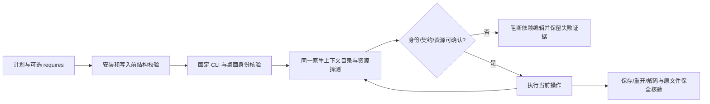

# FilmCraft 固定安装能力验收

[English](FilmCraft-Fixed-Capabilities.md)。正式行为由 [FC-RT-002](../openspec/changes/establish-v1-plugin/specs/runtime-distribution/spec.md) 管理；[验收记录](evidence/filmcraft44-fixed-capabilities-20261008.json) 完成任务 9.12。完整隔离升级、排空、回退和状态 schema 兼容仍由 2.4—2.6 跟踪，未勾选。

本次直接执行隔离 Codex 0.147.0 已安装的插件 dev.44（`fc03fe9b8af0ef314dde9e6b8c7ae6da9ed22f04`）／技能源 dev.41（`f47a2ff6e47e64767d82fd8d88ffa225b204879e`），保持 13 个技能和 22 个插件执行文件摘要不变。CLI 为 `0.2.0-craft.4`、SHA256 `80dfc579f7639dc1d182c4dc9ab9cd834beaa234e6144e664757d40632f36893`；签名桌面为 `0.2.0`、SHA256 `f47862a07ce43aa3d3bc14344dc2d9015cc3ca5a21f9868271007cba8f7f99fa`；平台为 darwin-arm64。CLI 与桌面分别绑定身份，不以版本字符串相同推导兼容。

验收脚本是发布后的外部 QA；本记录不声称这些脚本或本轮证据已经包含在原 dev.44 ZIP。固定发行标签及安装文件没有被改写。

| 执行层 | 已观察结果 | 限制 |
| :--- | :--- | :--- |
| 公开 CLI 预检 | 273 用例：13 技能 × commands/workflow/desktop 三入口 × 7 种非法 requires，均在创建安装及输出目录前拒绝 | desktop 使用既有 stderr/退出码协议，其余两入口使用 JSON 错误 |
| commands headless/owned bridge | 32 场景的预期断言通过；默认计划、身份绑定重开、身份错配、三类资源缺失/未知、后续契约漂移、模型更新重探测 | 包含预期 FAIL 回执；仅限定计划，不代表所有命令执行通过 |
| 领域 workflow headless | 13 场景通过：默认及绑定计划、返工、身份错配、三类资源缺失/未知；实际导出解码、重开及原交付目录摘要保全 | 领域工作流明确仅支持 headless，bridge 不适用 |
| 实际桌面差异 | file.importImageSequence 参数原文与 CLI 不同；依赖计划在首次编辑前拒绝，所有 owned 进程退出 | 保留 drift，不提升为全目录兼容 |
| 模型资源更新 | 隔离目录内实际下载 whisper-tiny；先确认未安装，下载后再次探测，后续推理命令的资源门禁观察 available | 空 items 在资源门禁之后由原生拒绝；不证明语音质量 |

三类资源分别是 codec、font、model。缺失场景使用原生目录中不存在的资源名；未知场景通过真实会话上的受控畸形回复注入验证，一共 11 个受控故障场景（含两个后续契约漂移）。注入前原生回复摘要和注入后回复分开保留；不能把这些场景称为真实资源可用。

保存／重开／再存逐项比较工程 JSON。Save As 按目标文件名改变 `project.name` 和 `project.root.name`；这两个预期变化有明确断言，其余工程字段必须相等。每次失败也核验原工程及非目标文件摘要。领域工作流失败暂存中的 capabilities.json 由失败清单的实际文件摘要绑定，不自动重放编辑。桌面每次使用独立数据目录和实际拥有的 loopback listener，退出后核验本次进程停止。

复验先使用 `scripts/verify_fixed_install.py` 创建固定标签的实际隔离安装，再以该输出目录为 `--host` 运行 `scripts/verify_fixed_capabilities.py` 与 `scripts/verify_workflow_capabilities.py`。两者接受 `--authority`、`--ref`、`--output`，输出目录必须全新；前者实际下载固定 CLI/桌面及隔离语音模型。公共报告不含安装路径或用户媒体。完整命令目录与针对计划的回执投影、原生请求轨迹、输入和产物摘要分别留存；内容摘要与文件字节摘要的定义见证据记录。

六个维度分别报告发现、身份/参数、正向执行、拒绝、重开及非目标保全。当前受验范围仅为上述固定 macOS arm64 组合和限定计划；其他平台、完整命令、字体显示、模型推理质量、宿主模型路由以及完整 V1 继续保持 NOT_RUN／NOT_PROVEN。不要使用本任务的完成状态关闭完整运行时升级或其他计划任务。
