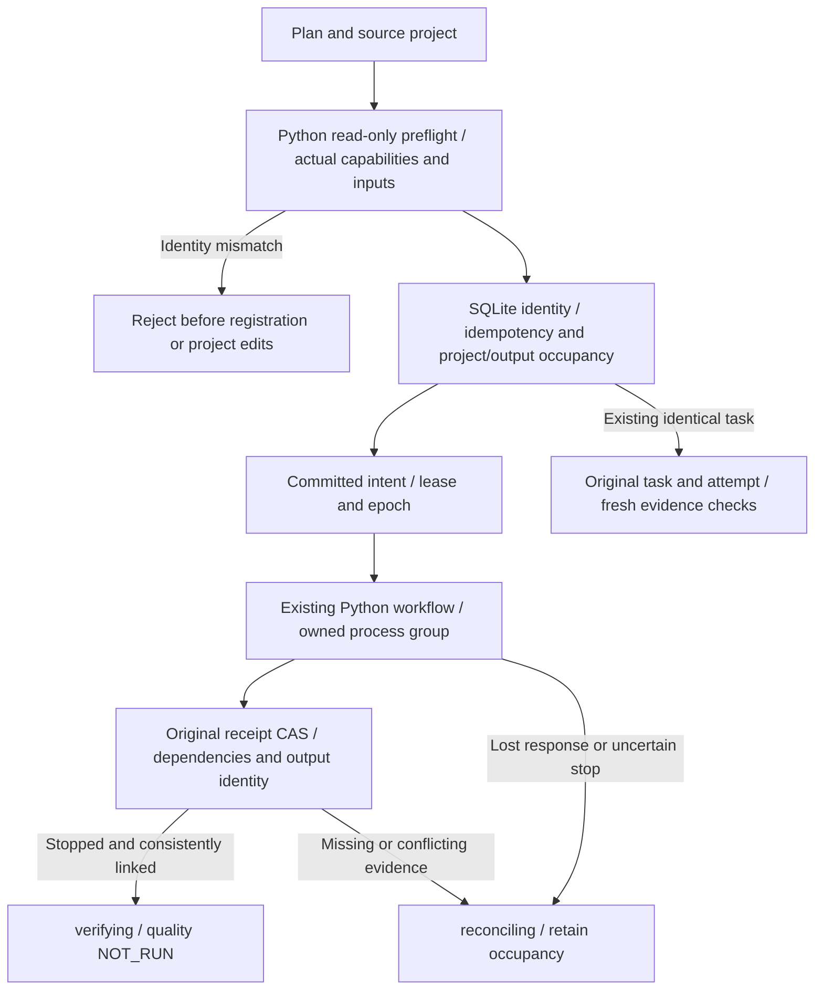

# FilmCraft Harness Source Candidate

Historical baseline: this page and its report describe the initial version-bound candidate. Current dev.42 changes and remaining gates are recorded in the [development release verification](FilmCraft-Dev42-Release.md); the original report is not rewritten as evidence for changed code.

Status: source candidate, 2026-10-08. [中文](FilmCraft-Harness-Candidate.zh_CN.md). The [existing OpenSpec](../openspec/changes/establish-v1-plugin/specs/) remains authoritative for tasks 3.1—3.6, 5.1—5.3 and 9.13—9.18. This candidate does not close those complete requirements. See the [version-bound evidence](evidence/filmcraft-harness-candidate-20261008.json).

## Implemented execution path

Node.js 24 runs TypeScript natively. SQLite persists tasks, project and output occupancy, leases/epochs, operation attempts and receipt indexes. Existing independent-source Python workflows retain responsibility for native editing, saving, reopening and exporting. Pinned plugin skills remain unchanged; the adapter requires an explicit source candidate containing capability support and rejects older snapshots lacking it.



`src/harness/task_ledger.ts` owns operation state; native projects and quality conclusions retain their own authorities. The ledger uses WAL, FULL synchronization and transactions, rejecting unknown databases, versions and application_id values. Project keys and canonical output paths are independently exclusive. Parent aliases, including macOS `/var`, resolve to their real location without creating missing directories. Expired leases fence old epochs without automatically taking over unknown work.

`src/adapters/python_workflow.ts` compares plans, actual inputs, source projects, skill contents and runtime identity before registration, then checks plan files, projects and skill contents again before submission. Intent commits before the existing Python process starts. Idempotent reuse returns original task/attempt identities without re-executing the workflow, while performing read-only preflight and evidence checks. Confirmed process-group termination and consistent delivery/output records permit verifying, never completed or quality PASS.

## Legacy receipt mappings

| Record | Verifiable identity | Missing/conflicting evidence |
| :--- | :--- | :--- |
| craft-command-receipt/v1 | Python command-plan digest, inputs, runtime and mode | Missing fields remain unknown; conflicts never replace originals |
| filmcraft-delivery/v1 | Workflow plan, source project, packaged inputs, file hashes and capabilities | Recheck every file; changed candidates become stale and yield no consumable outputs |
| craft-failed-stage/v1 | Original failure and available fields | Preserve bytes, retain unknown historical identities, never follow external stage paths or authorize replay |
| filmcraft-output-execution/v1 | Canonical target, workflow plan, newly declared inputs, source project and runtime | Inherited inputs are bound through source-project hashes and delivery manifests, separately from this plan's assets |

Original bytes enter SHA-256 CAS without rewriting native integers. Strict parsing rejects duplicate keys; integers outside JavaScript's safe range retain their decimal text in read projections. Identity objects reject unsafe numeric values. Traversal, links and oversized files are rejected. CAS and current files are rechecked; cross-attempt data and conflicting receipt kinds cannot be spliced into success.

`scripts/plan_identity.py` preserves Python command hashes with sorted keys, default spacing and ASCII escapes; workflow hashes use sorted keys, compact separators and ASCII escapes; normalized domain-plan hashes use sorted keys, compact separators and UTF-8. These identities remain explicitly separate. Native plans are not rewritten through JavaScript numeric parsing. Source-content fingerprints sort relative paths and hash `path + NUL + bytes + NUL` for each file, excluding `__pycache__` and rejecting links. This algorithm is distinct from release vendor locks.

## Public protocols and verification

`src/adapters/protocol_mapping.ts` maps registered identities into pinned `craft-task/v1`; artifact mapping consumes pinned `craft-artifact/v1`, retaining input versions, native-project, packaged-dependency and exchange-loss references. No public schema is copied. Without independent media recognition, artifacts use application/octet-stream and empty technical metadata rather than inferred decoding claims.

`scripts/validate_protocol_mapping.py` reads schema Git objects from the [fixed owner reference](contracts-reference.json), checks tags, commits and digests, and validates actual task/artifact mappings. It requires existing jsonschema and owner Git objects; missing prerequisites remain unverified without installation or mutable-branch fallback.

```bash
npm test
# SKILL_DIR is the explicit independent source candidate; SOURCE_REVISION is its actual commit.
FILMCRAFT_NATIVE_SKILL="$SKILL_DIR" FILMCRAFT_NATIVE_SOURCE_REVISION="$SOURCE_REVISION" FILMCRAFT_HARNESS_REPORT="$REPORT" npm run test:native
python3 scripts/validate_protocol_mapping.py --report "$REPORT" --authority "$ARTCRAFT_REPOSITORY"
```

The native Node regression passed all 22 tests without skips, including real creation, revision, original-project preservation, aliased paths, input-identity rejection and idempotent reuse. All 28 plugin Python regressions passed. Ordinary npm test reports 21 passes and one explicit native-environment skip; native verification ran separately. Two actual task objects and 13 artifacts passed fixed owner schemas; five invalid mappings were rejected. GitHub CI and TypeScript static typechecking have not run; native TypeScript execution is not typechecking.

## Remaining scope

No public submit API, authorization-scope executor, budget/cancellation controller, read-only forensic diagnostics, state repair or unknown-operation recovery interface is provided. Hosts must enforce authorization; reference and budget mappings do not enforce permissions or limits. Exceptions or unconfirmed stops retain occupancy without stopping unrelated processes. Recovery after submission-record failure still needs fault-injection acceptance.

Independent technical/creative review, user acceptance, pinned installs, Windows, complete headless/bridge matrices, all-command and real-media matrices remain open. Receipt reads are capped at 16 MiB; media currently uses bounded whole-file reads up to 512 MiB, which does not establish long-media or adversarial filesystem-race acceptance. Fixed-release dependency 9.12 remains unmet, so tasks 9.13—9.15 stay unchecked and full V1 remains open.
