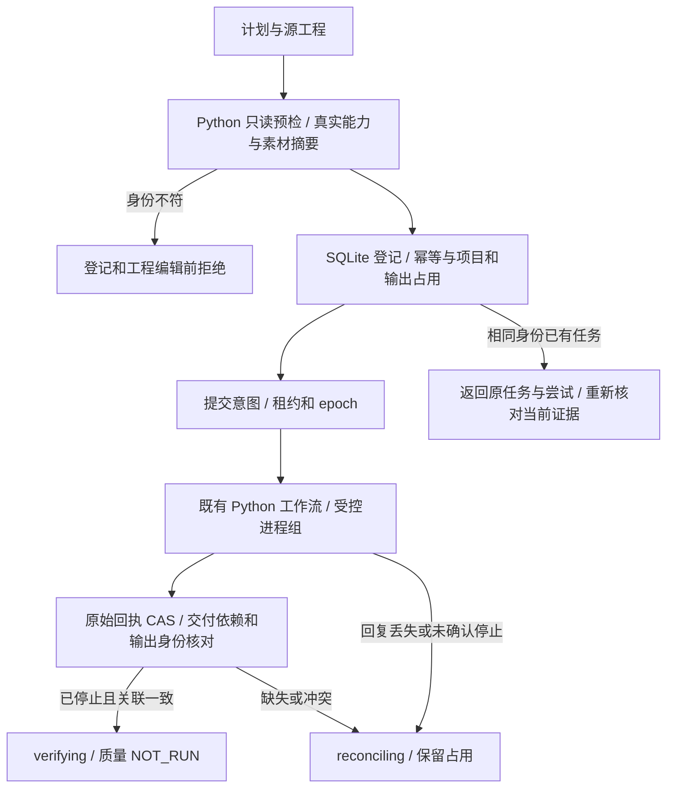

# FilmCraft Harness 源码候选

历史基线：本页及报告描述初始版本绑定候选。当前 dev.42 的变化与未关闭门禁见 [开发发行验证](FilmCraft-Dev42-Release.zh_CN.md)；不将原报告改写为当前变更代码的证据。

状态：源码候选，2026-10-08。[English](FilmCraft-Harness-Candidate.md)。正式合同仍在 [现有 OpenSpec](../openspec/changes/establish-v1-plugin/specs/)，对应 3.1—3.6、5.1—5.3、9.13—9.18；本候选不关闭整项任务。证据见 [版本绑定报告](evidence/filmcraft-harness-candidate-20261008.json)。

## 已实现的执行链

Node.js 24 原生运行 TypeScript；SQLite 持久化任务、工程与输出占用、租约/epoch、操作尝试和回执索引。现有独立技能源的 Python 工作流仍负责原生编辑、保存、重开和导出。插件固定技能副本未修改；需要包含能力适配器的显式技能源候选目录，旧固定快照缺少该模块时拒绝。



`src/harness/task_ledger.ts` 是操作状态权威；原生工程和质量结论分别保留自身权威。账本使用 WAL、FULL 同步和事务；未知数据库、版本或 application_id 不被当作新账本。项目键和规范化输出路径分别独占；路径父目录的别名统一到真实位置，包括 macOS `/var` 别名，尚不存在的子目录不会因规范化而创建。租约过期只隔离旧 epoch，不自动接管未知操作。

`src/adapters/python_workflow.ts` 在登记前比较计划、实际素材、源工程、技能源内容与运行时；提交前再次检查计划文件、源工程和技能源。副作用意图先提交到 SQLite，再启动现有 Python 工作流。重复幂等调用返回原 taskId/attemptId，不再执行工作流；仍进行只读预检与证据核对。确认进程组已停止且交付与输出回执一致后进入 verifying；不提供 completed 或质量通过捷径。

## 旧回执映射

| 记录 | 可核对身份 | 缺失/冲突处理 |
| :--- | :--- | :--- |
| craft-command-receipt/v1 | Python 命令计划摘要、输入摘要、运行时和模式 | 缺失为 unknown，冲突不覆盖原记录 |
| filmcraft-delivery/v1 | 工作流计划、源工程、素材包、文件摘要及能力快照 | 逐文件重查；候选变化为 stale，不返回可消费产物 |
| craft-failed-stage/v1 | 原始失败与已有字段 | 保留原字节；历史缺失字段 unknown，不跟随外部 stage 路径，不允许重放 |
| filmcraft-output-execution/v1 | 规范化目标、工作流计划、本轮新增输入、源工程与运行时 | 继承素材由源工程摘要和交付清单绑定，不误作本轮 plan.assets |

原始回执以 SHA-256 存入 CAS，不重写原生大整数。严格解析拒绝重复键，非 JavaScript 安全整数仅在读取投影中保留十进制原文；身份对象禁止不安全整数。目录穿越、链接与超限文件拒绝。CAS 和当前文件均重新核对，跨尝试关联和同类冲突回执不能拼接成成功。

计划摘要由 `scripts/plan_identity.py` 计算：命令回执保持 Python 排序、默认空格及 ASCII 转义；工作流摘要保持排序、紧凑分隔符及 ASCII 转义；领域规范化计划摘要采用排序、紧凑分隔符及 UTF-8。三者分别命名，不混用，不通过 JavaScript 数值解析重写原生计划。技能源内容摘要按相对路径排序，对每个文件依次哈希 `path + NUL + bytes + NUL`，忽略 `__pycache__`、拒绝链接；它与发行 vendor 锁算法不同，不能互换。

## 公共协议与验证

`src/adapters/protocol_mapping.ts` 从已登记任务映射固定 `craft-task/v1`；产物映射固定 `craft-artifact/v1`，保留输入版本、原生工程、打包依赖和交换损失引用。公共 schema 不复制到领域仓。没有独立媒体识别结果时使用 application/octet-stream 和空技术元数据，不猜测解码结果。

`scripts/validate_protocol_mapping.py` 从 [固定协议所有者引用](contracts-reference.json) 的 Git 对象读取 schema 并核对 tag、commit 和摘要，验证实际报告中的任务和产物对象。此命令要求已有 jsonschema 和所有者 Git 对象；缺少时报告未验证，不自动安装或使用可变分支。

```bash
npm test
# SKILL_DIR 指向显式独立技能源候选，SOURCE_REVISION 为实际来源提交。
FILMCRAFT_NATIVE_SKILL="$SKILL_DIR" FILMCRAFT_NATIVE_SOURCE_REVISION="$SOURCE_REVISION" FILMCRAFT_HARNESS_REPORT="$REPORT" npm run test:native
python3 scripts/validate_protocol_mapping.py --report "$REPORT" --authority "$ARTCRAFT_REPOSITORY"
```

本轮 Node 原生回归 22 项无跳过通过，包含真实创建、返工、原工程保全、别名路径、错误素材身份拒绝与幂等复用；Python 插件回归 28 项通过。普通 npm test 为 21 通过、1 项显式原生环境跳过；原生专项单独执行。实际 2 个任务及 13 个产物通过固定所有者 schema，5 类无效对象被拒绝。GitHub CI 尚未执行，未运行 TypeScript 静态类型检查；Node 原生 TypeScript 执行不等于类型检查。

## 仍开放的范围

没有公共 submit API、授权范围执行器、预算/取消、只读 forensic 诊断、状态修复或未知操作恢复接口。宿主仍须核验授权，本候选中的授权引用与预算映射不构成权限和限额执行。异常或未确认停止保留占用，不尝试结束无关进程；进程提交登记失败后的恢复仍待故障注入验收。

独立技术/创作评审、用户接受、固定发行安装、Windows、完整 headless/bridge 矩阵、全量命令及真实媒体矩阵仍开放。回执读取有 16 MiB 上限，媒体文件当前最多 512 MiB 且整块读取；这不是长媒体或敌对文件系统并发替换的完整验收。9.12 固定发行依赖未满足，9.13—9.15 保持未勾选，完整 V1 不由本候选关闭。
