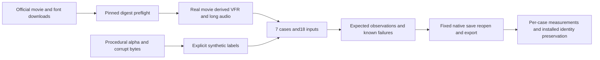

# Real media matrix

Fixed dev.54/source46/public craft.5 passes all seven native media cases in an actual isolated Codex installation, preserving all13 skill and executable identities. OpenSpec9.32 and9.33 are complete;48 full-V1 tasks remain open. Scope is bounded to current macOS arm64, Codex and codecs; creative, user and other-platform acceptance remain open. [Fixed evidence](evidence/filmcraft54-fixed-media-20261009/report.json).

OpenSpec9.31–9.33 are complete within the fixed dev.54 evidence scope. Preparation alone proves input identity; native execution is separately measured below.

The complete720p Tears of Steel movie comes from Blender Foundation. The [official license statement](https://mango.blender.org/about/) specifies CC-BY-3.0; the original retains its credit scroll. Media stays private and is neither committed nor attached to releases. The VFR derivative deliberately drops frames of real footage; it is not original variable-rate camera capture. Long audio derives from the movie track, not the separately licensed soundtrack album. Noto Sans comes from Google Fonts with its accompanying [OFL-1.1](https://github.com/google/fonts/blob/main/ofl/notosans/OFL.txt); downloading it does not install a font.

`scripts/media_matrix.py` verifies all three registered download digests before creating output or launching external tools. Validation checks file sizes/SHA256, refuses path escape and symlinks, verifies parent inputs and detects cycles. Every required case and expected observation must exist. Preparation cannot claim native PASS.

| Case | Observable expectation | Native status |
| --- | --- | --- |
| VFR |54 source frames with approximately1/24 and1/12 second intervals; native output duration within one frame; independent audio/video timestamp checks | NOT_RUN |
| Long audio tail |181.211333 seconds,48000Hz,8698144 samples; final544 samples have signal; aligned normalized output tail correlation at least0.98 and lag within one frame | NOT_RUN |
| Font change |Actual font discovery and identity plus native pixel differences; no silent fallback | NOT_RUN |
| Transparent sequence |Explicitly synthetic transparent/half-alpha/opaque pixels; native PNG composite within3/255 per channel | NOT_RUN |
| Bad file |Invalid MOV bytes cannot produce successful delivery | NOT_RUN |
| Missing font |Deliberately unavailable font is explicitly refused | NOT_RUN |
| Moved dependencies |Collected dependency digests preserved; native reopen with source unavailable; subsequent missing collected dependency refused | NOT_RUN |

All64 Python tests pass. See the [preparation evidence](evidence/filmcraft-media-fixtures-20261008/summary.json) and [input manifest](evidence/filmcraft-media-fixtures-20261008/manifest.json). Fixed installed native receipts, frame/sample assertions and failure paths remain required. File existence, synthetic calibration, screenshots and structural scores cannot replace acceptance. Full V1 still has50 open tasks.

First fixed52/source44 real-derived VFR probe for9.32 saves/exports and fully decodes a3.008-second movie, but independent8kHz mono normalized audio correlation is0.49865, below0.98. Window diagnostics also degrade; root cause remains unconfirmed. Tasks9.32/9.33 stay open and thresholds remain unchanged. Evidence: docs/evidence/filmcraft-media-fixtures-20261008/vfr-native-probe.json.

## craft.5 native matrix runner

`scripts/verify_media_matrix.py` runs actual public-skill save/reopen/export/relink. `scripts/verify_fixed_media.py` additionally binds the real isolated Codex host receipt, immutable plugin/source, all13 skills and executable code, then downloads the public runtime into an empty cache for the same matrix. Candidate PASS cannot qualify fixed installation.

Seven craft.5 candidate cases pass: VFR36 frames/3.008 seconds with audio correlation0.999966 and zero lag;181-second stereo final544 PCM samples preserved exactly and AAC correlation>=0.999279; discovered Inter/Noto Serif font and OFL digests with1684 changed pixels;12 synthetic alpha frames use linear-light composition and sRGB output, half-alpha red188 and unchanged3/255 channel tolerance; corrupt input/missing font/missing dependency reject, distinguishing failure diagnostics from successful delivery; moved project relinks natively with pixels preserved. Noto Sans is not installed or claimed as used.

Eight runner/fixed-gate unit tests pass. See the [candidate matrix](evidence/filmcraft54-media-candidate-20261009/report.json) for provenance, licences, inputs/outputs and runtime hashes. Tasks9.32/9.33 remain unchecked until the new public fixed-plugin gate passes; other platforms/hosts, complete codecs/commands, creative/user acceptance and full V1 remain separate.
