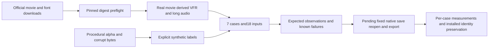

# Real media matrix

OpenSpec9.31 input preparation is complete. Native implementation9.32 and fixed installed execution9.33 remain open. Preparation PASS proves input identity and declared expectations only.

The complete720p Tears of Steel movie comes from Blender Foundation. The [official license statement](https://mango.blender.org/about/) specifies CC-BY-3.0; the original retains its credit scroll. Media stays private and is neither committed nor attached to releases. The VFR derivative deliberately drops frames of real footage; it is not original variable-rate camera capture. Long audio derives from the movie track, not the separately licensed soundtrack album. Noto Sans comes from Google Fonts with its accompanying [OFL-1.1](https://github.com/google/fonts/blob/main/ofl/notosans/OFL.txt); downloading it does not install a font.

`scripts/media_matrix.py` verifies all three registered download digests before creating output or launching external tools. Validation checks file sizes/SHA256, refuses path escape and symlinks, verifies parent inputs and detects cycles. Every required case and expected observation must exist. Preparation cannot claim native PASS.

| Case | Observable expectation | Native status |
| --- | --- | --- |
| VFR |54 source frames with approximately1/24 and1/12 second intervals; native output duration within one frame; independent audio/video timestamp checks | NOT_RUN |
| Long audio tail |181.211333 seconds,48000Hz,8698144 samples; final544 samples have signal; aligned normalized output tail correlation at least0.98 and lag within one frame | NOT_RUN |
| Font change |Actual font discovery and identity plus native pixel differences; no silent fallback | NOT_RUN |
| Transparent sequence |Explicitly synthetic transparent/half-alpha/opaque pixels; native PNG composite within3/255 per channel | NOT_RUN |
| Bad file |Invalid MOV bytes cannot produce successful delivery | NOT_RUN |
| Missing font |Deliberately unavailable font is explicitly refused | NOT_RUN |
| Moved dependencies |Collected dependency digests preserved; native reopen with source unavailable; subsequent missing collected dependency refused | NOT_RUN |

All64 Python tests pass. See the [preparation evidence](evidence/filmcraft-media-fixtures-20261008/summary.json) and [input manifest](evidence/filmcraft-media-fixtures-20261008/manifest.json). Fixed installed native receipts, frame/sample assertions and failure paths remain required. File existence, synthetic calibration, screenshots and structural scores cannot replace acceptance. Full V1 still has50 open tasks.
