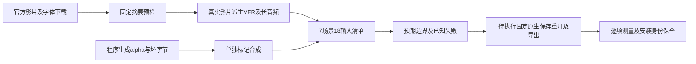

# 真实媒体矩阵

OpenSpec9.31已完成输入准备；9.32原生实现和9.33固定安装矩阵仍未完成。此处的PASS只证明输入、来源和预期完整，不能证明成片通过。

真实输入来自Blender Foundation《Tears of Steel》完整720p影片。官方[许可说明](https://mango.blender.org/about/)为CC-BY-3.0，原始影片保留片尾署名；所有媒体仅存于私有验证目录，不提交或作为发布附件分发。VFR由真实影片显式丢帧产生，不能称为原生可变帧率摄影；长音频从影片音轨截取，不使用单独原声专辑的许可代替影片许可。字体来自Google Fonts Noto Sans，自带[OFL-1.1](https://github.com/google/fonts/blob/main/ofl/notosans/OFL.txt)，下载不等于安装字体。

`scripts/media_matrix.py`在创建输出和调用外部工具前核验三个已登记下载摘要。清单验证逐文件大小与SHA256、拒绝路径逃逸和符号链接、校验父输入存在及无循环；七个场景及其预期缺失即失败。输入准备禁止声明原生PASS。

| 场景 | 预期边界 | 原生状态 |
| --- | --- | --- |
| VFR | 当前派生输入54帧，间隔约1/24及1/12秒；原生输出时长误差不超过一输出帧，独立检查音画时间戳 | NOT_RUN |
| 长音频尾部 | 181.211333秒、48000Hz、8698144采样；末544采样非零，导出尾部对齐后归一化相关性至少0.98、偏移不超过一帧 | NOT_RUN |
| 字体变化 | 实际字体发现、声明身份与原生像素差异；缺字体不可悄悄替换 | NOT_RUN |
| 透明序列 | 明确合成的透明／半透明／不透明像素；原生PNG合成误差每通道不超过3/255 | NOT_RUN |
| 坏文件 | 无效MOV字节不能生成成功交付 | NOT_RUN |
| 缺字体 | 故意不存在的字体明确拒绝 | NOT_RUN |
| 依赖移动 | 收集文件摘要保全，源目录不可用后原生重开；再缺少收集依赖应拒绝 | NOT_RUN |

输入验证64项Python测试通过。准备证据及来源摘要见[记录](evidence/filmcraft-media-fixtures-20261008/summary.json)和[完整清单](evidence/filmcraft-media-fixtures-20261008/manifest.json)。下一步执行固定安装副本，保存原生回执、逐帧／采样断言与失败路径；不以文件存在、合成样例、截图或结构评分代替验收。完整V1仍有50项开放。
