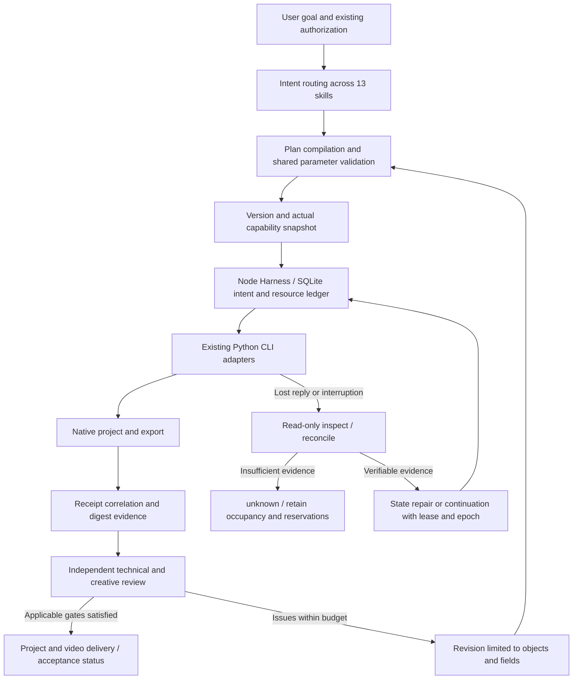

# FilmCraft Comparative Optimization Design

Status: target design, 2026-10-08; some tasks have source candidates, with completion limited to their version-bound evidence. This update adds reference provenance and acceptance traceability to documentation only. The initial authoring baseline is plugin commit `90da28e`; it is not implementation or acceptance evidence for the new work. [中文](FilmCraft-Optimization-Architecture.zh_CN.md)

## Scope and authority

The sole behavioral authority is [establish-v1-plugin/specs](../openspec/changes/establish-v1-plugin/specs/). [Section 9 of tasks.md](../openspec/changes/establish-v1-plugin/tasks.md#9-dreamina-对照优化增量2026-10-08) and [traceability.json](traceability.json) track implementation and acceptance. This document explains design decisions without creating separate requirements or completion criteria. Existing bounded verification remains valid within its original scope; full V1 and the added optimizations remain open.

Dreamina provides useful patterns for intent routing, progressive disclosure, durable operation attempts, independent review, artifact-bound evidence, and restricted revisions. FilmCraft retains native local projects, exact timing, reopen verification, and preservation of untouched content. Cloud authorization, credits, and submission identifiers are not copied as local editing semantics. Tests from the reference repositories do not establish FilmCraft acceptance.

## Reference provenance and decisions

The use/harness skills and `operation_ledger.py`, `artifact_guard.py`, `judge_exchange.py`, `prompt_revision.py`, and `budget.py` were read directly at Dreamina Canvas plugin commit `3d21ce5e7ddb164a626f18701f9f4ed8ba279f2b`. The [reference table in the formal design](../openspec/changes/establish-v1-plugin/design.md#参考出处与领域取舍) provides immutable links, FilmCraft mappings, and semantics that must be adapted. Routing, video evaluation, and production skills in the independent Dreamina source provide supplementary static references; their declarations do not prove installed tools or accepted workflows.

Neither Dreamina repository nor the FilmCraft plugin has an initialized CodeGraph index. This review used current files without creating indexes. Shared tick validation, capability drift, current identities, layered CI, and real-media matrices address FilmCraft gaps; they are not claims that Dreamina implements these behaviors.

## Responsibilities and execution path

The Harness and review loop above describe the target design, not a completed implementation. Node.js 24/TypeScript + SQLite handles scheduling, intents, leases, and budgets; Python executes the existing native operations. Skill sources remain in the independent `filmcraft-skills` repository, which generates self-contained copies. The plugin consumes pinned release snapshots. ArtCraft owns `craft-task/v1` and `craft-artifact/v1`; FilmCraft defines consumer mappings rather than another public protocol.

Native projects own editing data, the execution ledger owns operation state, and quality evidence owns review conclusions. Existing command receipts, delivery manifests, failed-stage records, and output-execution records use explicit compatible mappings. Missing or conflicting records cannot be assembled into success evidence. Correlation includes taskId, planHash, inputHashes, sourceRevision, runtimeIdentity, operation attempts, and candidate digests.

## Priorities and task mapping

| Priority | Optimization and acceptance focus | Requirement / tasks |
| :--- | :--- | :--- |
| P0 | Shared native tick validation before execution and after reference resolution; exact large integers | FC-CM-001 / 9.1—9.3 |
| P1 | Current identity and counts derived from authoritative configuration; historical evidence remains historical | FC-RL-001 / 9.4—9.6 |
| P1 | Positive and negative routing cases, task-specific templates, and isolated installs for 13 skills | FC-SK-003 / 9.7—9.9 |
| P1 | Actual parameter contracts, modes, platforms, and required resources | FC-RT-002 / 9.10—9.12 |
| P1 | Receipt lineage, compatible mappings, and state authority boundaries | FC-AR-001 / 9.13—9.15 |
| P1 | Read-only diagnosis separated from recovery mutations; no replay of uncertain operations | FC-TX-002 / 9.16—9.18 |
| P1 | Durable local budgets, reservations across restarts, and confirmed native cancellation | FC-TX-003 / 9.19—9.21 |
| P1 | Independent review context, temporal/audio evidence, and invalidation of old conclusions | FC-QA-001 / 9.22—9.24 |
| P1 | Scoped revisions, preservation of untouched content, and plateau/budget stopping | FC-QA-002 / 9.25—9.27 |
| P2 | Layered CI and acceptance across source, plugin, and pinned installs | FC-RL-001 / 9.28—9.30 |
| P2 | VFR, long audio tails, fonts, transparent sequences, and damaged media | FC-DM-006 / 9.31—9.33 |

These tasks refine existing open tasks and share implementation and evidence instead of duplicating functionality. P2 controls matrix expansion order, not release-gate strength. Each three-task group covers failing cases, implementation, and verification; completion requires evidence for that task.

The [task acceptance index](../openspec/changes/establish-v1-plugin/tasks.md#验收索引与交付记录) lists scenario IDs and evidence fields, governed by FC-RL-001-OPTIMIZATION-TRACE. Source, pinned-install, host, and platform results remain separate. Missing required scenarios stay NOT_RUN; aggregate pass counts do not establish individual coverage. Existing completed tasks and evidence retain their original scope.

## Parameters and capability boundaries

The priority regression input is `multicam.cutToCamera` with `time: "254016000000"`. Native entry points must consistently reject numeric strings, while explicit domain-time conversion still supports the domain contract's string representation. Tests also cover booleans, floats, overflow, nested transcript word timing, resolved `$ref` values, and exact integer `2^53+1`. Passing the wrong plan structure to an entry point must produce a clear error. A validation discrepancy does not prove an erroneous native edit; failing and fixed behavior must be recorded by the planned tests.

Snapshots capture actual CLI/desktop identities, command catalogs and available parameter contracts, headless/bridge mode, platform, codecs, models, and fonts. Unknown values remain unknown; command discovery does not prove native execution. Per-command evidence separates discovery, parameter validation, positive/negative execution, persistence, and preservation, with mode and platform recorded. JSON-like strings must not be invented into complete parameter schemas.

Plans may declare an optional top-level `requires` object with `mode`, `platform`, `runtimeVersion`, `runtimeSha256`, `desktopSha256`, `parametersSha256`, and `resources`. Each resource is `{kind, name}`, with kind limited to codec, model, or font. Callers cannot assert availability; invalid declarations fail before installation or writes. Existing plans without declarations still undergo required live contract and resource checks. Domain workflows support headless only; bridge execution requires a verified desktop identity. This extends domain plans without copying a public protocol.

Read-only `export.formats`, `fonts.list`, and `transcript.models` queries probe resources in the same native execution context. A listed model is not necessarily installed. Changed resources and contracts are checked before dependent operations, including a fresh probe after explicit model installation. Missing or unknown prerequisites block dependent edits; successful and failed executions retain capability evidence. Discovery does not establish display, inference, or export acceptance. Normative scenarios FC-RT-002-PLAN-REQUIRES and FC-RT-002-RESOURCE-PROBE remain subject to tasks 9.10—9.12.

## Recovery, budgets, and authorization

Read-only diagnosis inspects original intents, project/artifact digests, and owned process identities without writing the ledger, unlocking, or submitting. State repair or continuation must reference diagnostic evidence and pass lease/epoch checks. Insufficient evidence remains unknown. Distinguish saved projects with lost replies, completed exports with missing logs, surviving native processes after host exit, and corrupt state.

Recovery acceptance also covers preservation of original database and WAL/SHM bytes, changes during diagnosis, stale evidence, concurrent repairs, repeated repairs, and state-version compatibility. SQLite checks use a consistent isolated copy without creating sidecars at the original location. Mutating repairs persist an intent first and recheck evidence and epoch. Repeated repairs reuse the same attempt without replaying native operations or deriving quality approval from verifying. Diagnosis never migrates state; supported upgrades preserve records under the backup policy, while unknown or foreign ledgers are rejected. Normative scenarios are FC-TX-002-FORENSIC-SNAPSHOT, FC-TX-002-REPAIR-FENCING, FC-TX-002-REPAIR-REUSE, and FC-TX-002-STATE-COMPATIBILITY; tasks 9.16—9.18 record individual results. These remain target acceptance requirements.

Budgets cover time, disk, output bytes, concurrency, and revision rounds; reservations survive restarts. Cancellation first records cancel_requested and stops dependent scheduling. Only confirmed native termination permits cancelled. When cancellation is unavailable, retain running or unknown state and do not terminate unrelated processes. Recovery and revisions within the original scope reuse authorization; new scope or changed authorization constraints require renewed authorization.

## Quality and release evidence

Reviews bind project, candidate, goal, rubric, execution, and reviewer identities. They receive necessary artifact evidence without treating the generator's self-justification as a scoring basis. Host, external, and human reviewers are supported; additional agents are not mandatory. Engineering, technical, creative, and user acceptance results remain separate. Static frames cannot establish synchronization, clipping, or pacing; missing capabilities produce NOT_RUN/manual_review.

Revisions constrain time ranges, objects, tracks, fields, and dependencies, check the expected source digest, and verify non-target differences. Every new candidate is reviewed again. Round, failure, resource, or plateau limits stop the loop and retain the best verified candidate; absence of a qualified candidate is reported explicitly.

Source tests, actual CI, pinned installs, real media, hosts, and platforms report evidence separately with current identity bindings. Source repositories own business/resource/routing and entry-point regression; the plugin owns pinned-source, metadata, and protocol checks; installed copies own cold startup and native acceptance. Structural scores and file existence do not replace behavioral verification, and missing environments cannot silently skip gates. Real-media fixtures record provenance, license or authorization, digests, and expectations; private user media must not be committed.
