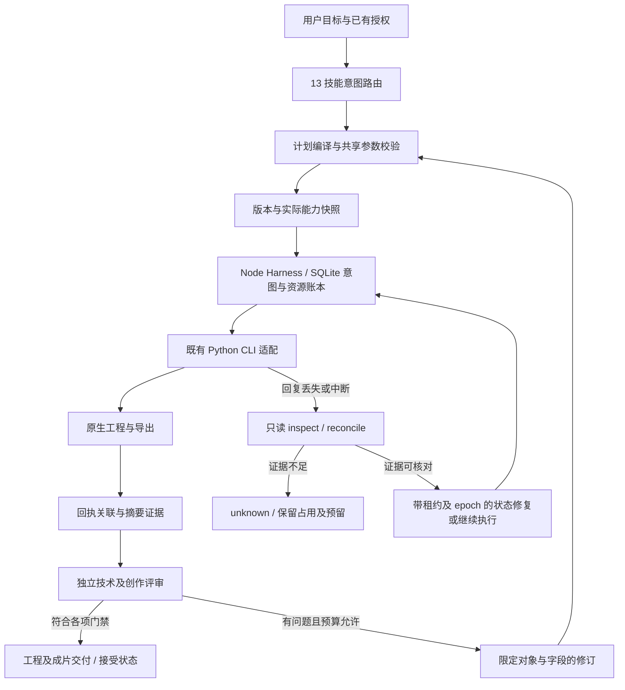

# FilmCraft 对照优化设计

状态：目标设计，2026-10-08；部分任务已有源码候选，完成范围见任务及版本绑定证据。本次补充参考出处与验收追踪，仅修改规格文档。最初编写基线为插件提交 `90da28e`，该提交不是新增能力的实现或验收证据。[English](FilmCraft-Optimization-Architecture.md)

## 范围与事实源

行为合同唯一事实源为 [establish-v1-plugin/specs](../openspec/changes/establish-v1-plugin/specs/)，实施与验收由 [tasks.md 第 9 节](../openspec/changes/establish-v1-plugin/tasks.md#9-dreamina-对照优化增量2026-10-08) 和 [traceability.json](traceability.json) 追踪。本文解释设计，不另设需求或完成标准。既有有界通过记录保留，完整 V1 和新增优化继续开放。

Dreamina 的参考价值是意图路由、渐进式披露、持久化操作尝试、独立评审、产物绑定证据和受限修订。FilmCraft 保留本地原生工程、精确时间、保存重开与局部保全的领域特征，不直接复制云端授权、积分或提交标识的业务含义。参考仓的测试结果不构成 FilmCraft 验收。

## 参考出处与取舍

已直接读取 Dreamina Canvas 插件固定提交 `3d21ce5e7ddb164a626f18701f9f4ed8ba279f2b` 的 use/harness 技能及 `operation_ledger.py`、`artifact_guard.py`、`judge_exchange.py`、`prompt_revision.py`、`budget.py`。逐文件固定链接、FilmCraft 落点和不照搬的语义见 [正式设计的参考表](../openspec/changes/establish-v1-plugin/design.md#参考出处与领域取舍)。独立 Dreamina 技能源的路由、视频评估及制作技能作为补充静态参考，技能声明不证明工具已安装或流程已验收。

本次核查的 Dreamina 两仓与 FilmCraft 插件均无 CodeGraph 索引，采用当前文件静态分析，未创建索引。统一 tick 校验、能力漂移、当前身份、分层 CI 与真实媒体矩阵属于 FilmCraft 自身补强，不能推断参考仓已经实现。

## 分工与执行路径

上述 Harness 和质量闭环是目标设计，不表示已经存在完整实现。Node.js 24/TypeScript + SQLite 负责调度、意图、租约和预算；Python 执行现有原生命令；技能源码继续在独立 `filmcraft-skills` 维护并生成自包含副本。插件只接收固定发布快照。`craft-task/v1` 与 `craft-artifact/v1` 由 ArtCraft 持有，FilmCraft 定义消费映射，不另建公共协议。

原生工程是编辑数据事实源，执行账本是操作状态事实源，质量证据是评审事实源。command receipt、delivery manifest、failed-stage 和 output-execution 等现有记录以显式兼容映射关联；缺失或冲突不补造成成功。关联字段包括 taskId、planHash、inputHashes、sourceRevision、runtimeIdentity、操作尝试和候选摘要。

## 优先级与任务映射

| 优先级 | 优化与验收重点 | 需求 / 任务 |
| :--- | :--- | :--- |
| P0 | 两类原生命令入口共享 tick 校验；字面和引用解析后均验证；保留大整数精度 | FC-CM-001 / 9.1—9.3 |
| P1 | 当前身份和数量从权威配置提取；历史证据不冒充当前状态 | FC-RL-001 / 9.4—9.6 |
| P1 | 13 技能路由正反例、自身业务模板和独立安装 | FC-SK-003 / 9.7—9.9 |
| P1 | 真实参数契约、模式、平台和必要资源快照 | FC-RT-002 / 9.10—9.12 |
| P1 | 回执血缘、兼容映射与状态权威分工 | FC-AR-001 / 9.13—9.15 |
| P1 | 只读诊断与有副作用恢复分离，不明确操作不重放 | FC-TX-002 / 9.16—9.18 |
| P1 | 持久化本地预算、跨重启预留和原生取消确认 | FC-TX-003 / 9.19—9.21 |
| P1 | 独立评审上下文、时序/音频证据及旧结论失效 | FC-QA-001 / 9.22—9.24 |
| P1 | 范围限定、非目标保全、停滞及预算停止 | FC-QA-002 / 9.25—9.27 |
| P2 | 源仓、插件和固定安装的分层 CI 与验收 | FC-RL-001 / 9.28—9.30 |
| P2 | VFR、长音频尾部、字体、透明序列和异常素材 | FC-DM-006 / 9.31—9.33 |

这些任务细化既有开放任务，共享实现和证据，不另做一套相同功能。P2 仅表示完善矩阵的顺序，不降低发行门禁。每组三项分别对应失败用例、实现和验证；只有本项证据成立才可勾选。

逐组场景 ID 和交付记录字段见 [任务验收索引](../openspec/changes/establish-v1-plugin/tasks.md#验收索引与交付记录)，约束见 FC-RL-001-OPTIMIZATION-TRACE。源码、固定安装、宿主和平台分别记录；每个必需场景的缺失结果保持 NOT_RUN，整体通过数不替代逐项覆盖。既有完成任务及其证据状态保持原范围。

## 参数与能力边界

优先回归输入为 `multicam.cutToCamera` 的 `time: "254016000000"`：原生入口须一致拒绝数字字符串，而显式领域时间转换仍支持领域合同的字符串表示。测试同时覆盖布尔、浮点、溢出、嵌套转录词时间、解析后的 `$ref` 和精确整数 `2^53+1`。计划结构错用入口应明确报错。校验发现问题不等于已经证明原生错误编辑；实际失败与修复需由任务中的测试记录。

快照记录实际 CLI/桌面身份、命令目录及可获得参数契约、headless/bridge、平台、编解码器、模型和字体。未知项保持 unknown；命令存在不证明原生可执行。逐命令证据分别列发现、参数验证、正负执行、持久化和非目标保全，并注明模式及平台。不把 JSON 风格字符串猜成完整参数 schema。

计划可选声明顶层 `requires`，字段为 `mode`、`platform`、`runtimeVersion`、`runtimeSha256`、`desktopSha256`、`parametersSha256` 与 `resources`；资源项为 `{kind, name}`，kind 限定 codec、model、font。声明不接受调用者自报可用状态，结构错误在安装或写入前拒绝。旧计划省略声明仍接受实时契约与资源检查；领域工作流仅支持 headless，bridge 必须核验实际桌面身份。这是领域计划扩展，不是公共协议副本。

资源通过同一原生上下文中的 `export.formats`、`fonts.list`、`transcript.models` 只读探测；模型目录存在不等于已安装。依赖操作前确认变化后的资源和契约，显式安装模型后重新探测。缺失或无法确认阻止依赖编辑，成功与失败均保留能力证据；发现状态不代替显示、推理或导出验收。规范场景为 FC-RT-002-PLAN-REQUIRES、FC-RT-002-RESOURCE-PROBE，仍由 9.10—9.12 验证。

## 恢复、预算与授权

只读诊断检查原意图、工程和产物摘要及受控进程身份，不改账本、不解锁、不提交。实际状态修复或继续执行必须关联诊断证据并通过租约/epoch 校验；证据不足继续 unknown。区分保存成功但回复丢失、导出完成但日志缺失、宿主消失但原生进程仍活跃及状态损坏。

恢复专项验收还包括原数据库及 WAL/SHM 字节保全、诊断期间变化、过期证据、并发修复、重复修复和状态版本兼容。需要 SQLite 检查时使用一致的隔离副本，原位置不创建附属文件；有副作用修复先持久化意图，重新核对证据与 epoch。重复修复复用同一尝试，不重放原生操作，也不从 verifying 推导质量通过。只读不迁移，受支持升级按备份策略保全记录，未知或外来账本拒绝认领。正式场景见 FC-TX-002-FORENSIC-SNAPSHOT、FC-TX-002-REPAIR-FENCING、FC-TX-002-REPAIR-REUSE、FC-TX-002-STATE-COMPATIBILITY，逐项结果见任务 9.16—9.18；这些是目标验收要求。

预算覆盖时间、磁盘、输出字节、并发和修订轮数；预留跨重启保持。取消先记 cancel_requested，停止依赖调度，只有确认原生结束才能标 cancelled；无取消能力时保留仍运行或 unknown，不结束无关进程。原范围内恢复和修订复用授权，新增范围或授权约束变化才询问。

## 质量与发行证据

评审绑定工程、候选、目标、rubric、执行和评审者身份，提供必要作品证据，避免生成器自我辩护影响评分。支持宿主、外部或人工评审，不强制额外 Agent。工程、技术、创作和用户接受分开记录；静态帧不能证明同步、削波或节奏，缺能力标 NOT_RUN/manual_review。

修订限定时间区间、对象、轨道、字段及依赖，检查预期源摘要并验证非目标差异；每次新候选重评。达到轮数、失败、资源或停滞阈值时保留最佳已验证候选；没有合格候选时明确报告。

源测试、实际 CI、固定安装、真实媒体、宿主和平台证据逐层报告并绑定当前身份。源仓负责业务/资源/路由与入口回归；插件负责固定源、元数据和协议；安装副本负责冷启动及原生验收。结构评分和输出存在不替代行为验证，环境缺失不得静默跳过。真实媒体 fixture 记录来源、许可或授权、摘要和预期；不得提交用户私有媒体。
