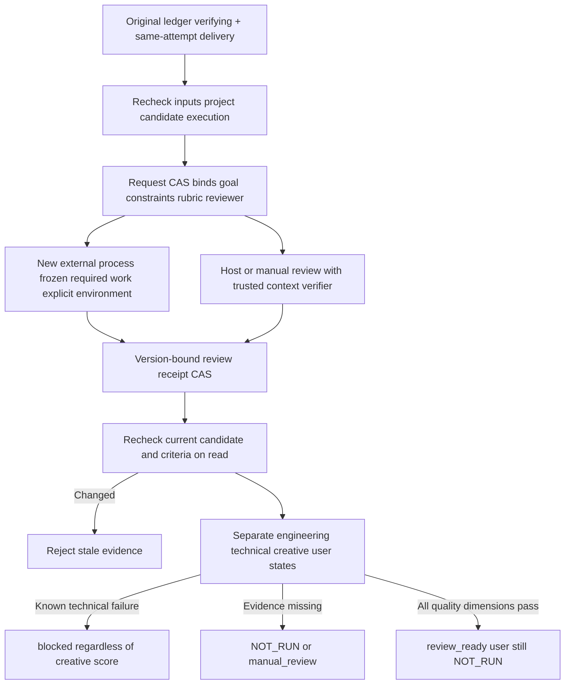

# FilmCraft independent quality review architecture

[简体中文](FilmCraft-Quality-Architecture.zh_CN.md). FC-QA-001 in OpenSpec `establish-v1-plugin` is authoritative for tasks9.22–9.24. Fixed dev.50/source42 installed acceptance now passes:107 tests without skips and8 quality scenarios among40 matrix records;13 skills/40 execution files remain unchanged. See [fixed evidence](evidence/filmcraft50-fixed-quality-20261008.json). Complete V1, bounded revision and the user-decision interface remain open.

`ReviewService.create` requires a freshly verified delivery from the current verifying attempt. The request binds the complete candidate file set, project and input hashes, task/attempt/epoch, execution/runtime identity, goal/constraints, rubric and reviewer implementation. `readCurrent` requires the caller's current authoritative criteria and rechecks delivery. Candidate, project, inputs, execution, epoch, goal, rubric or reviewer changes invalidate old PASS. Immutable quality CAS records are evidence, not another operation ledger. No task becomes completed automatically.

The external path actually starts a new Python process with a private working directory, four explicitly supplied environment keys and frozen read-only work. Only project.fcproj, film.mp4, captions.srt and required inputs matching declared hashes are exposed as content. Generator plans, operations, self-scores, conversation and defenses are excluded. Interpreter, reviewer, tool and work bytes are checked before and after execution; process and context identities are recorded. This separates context; it is not an OS sandbox, does not isolate all same-account filesystem access, and does not pin dynamic libraries. Host/manual imports require a trusted verifier to confirm independent identity, request and observed candidate. A receipt's freshContext declaration is insufficient.

The independent script measures native project reopen, full video/audio decode, presentation timestamps, requested duration, subtitle-sidecar timing bounds/order and PCM clipping in every channel of every audio stream. Opposite-phase clipping cannot hide in a mono downmix. Missing tools, timeout and bounded-output overflow do not pass. Valid subtitle timing does not prove burned-in readability. Explicit flash/pulse calibration markers support content-sync measurement, not general lip-sync or music judgment.

Known technical failures override rubric selection and creative score. Static frames cannot establish temporal/audio conclusions. Missing full video, decoded audio, caption timeline or independent creative evidence yields NOT_RUN/manual_review per dimension. Continuity, rhythm and readability require a capable independent reviewer; built-in measurement does not assign creative scores. Creative scores never imply user acceptance. A trusted user-decision interface and automatic local revision loop remain future work.

Evidence layers remain separate: deterministic Node/Python tests cover contracts, pollution refusal, invalidation and gates; an actual independent process checks context; a native generated project checks pinned reopen and original preservation; generated ffmpeg/ffprobe calibration checks sync offset, channel clipping, corrupt media, absent audio and subtitle overflow. Procedural calibration is not user footage and does not close tasks9.31–9.33, model routing, other platforms or full quality qualification.

`python3 scripts/verify_fixed_quality.py --help` lists the actual installed-acceptance arguments. It reuses the public fixed tag, isolated Codex installation, installed byte identities, full native/recovery/resource regression and public protocol-owner verification, then requires eight quality scenarios. Missing measurements and self-declared user acceptance are refused. The test host supplies runtime, host and tool paths explicitly; no global dependencies are installed or upgraded.
