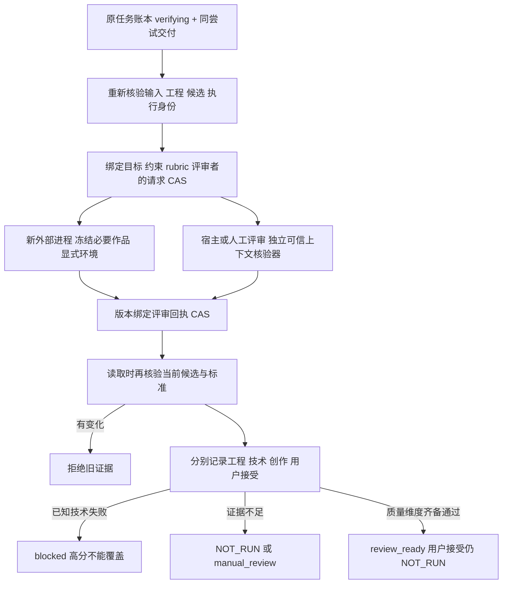

# FilmCraft 独立质量评审架构

[English](FilmCraft-Quality-Architecture.md)。行为事实源为 OpenSpec `establish-v1-plugin` 的 FC-QA-001；本增量对应9.22—9.24。当前源码候选已有验证，固定 dev.50 安装验收尚待执行，完整 V1、受限修订和用户接受接口继续开放。

`ReviewService.create` 只接受重新核验后仍处于 verifying 的同尝试交付。请求绑定完整候选文件集合、工程与输入摘要、任务/尝试/epoch、执行与运行时身份、目标/约束、rubric及评审程序身份。`readCurrent` 要求调用者提供当前权威标准，并再次核验交付；改候选、工程、输入、执行、epoch、目标、rubric或评审者会使旧 PASS 失效。质量 CAS 保存不可变请求和回执，不维护第二操作账本，也不将任务自动改为 completed。

外部路径实际启动新的 Python 进程，使用私有工作目录、显式四项环境变量和只读作品副本。暴露的内容限于 project.fcproj、film.mp4、captions.srt及摘要匹配的必要输入；生成器计划、操作、自评、聊天或辩护内容不进入上下文。执行前后校验程序、解释器、工具及作品字节，记录进程身份与上下文摘要。这是上下文分离，不是操作系统沙箱；不隔离同一账户的所有文件访问，也未锁定动态链接库。宿主/人工导入必须由可信核验器确认独立身份、请求和观察的候选，回执自行声明 freshContext 不生效。

独立量测脚本不读生成器自评。原生工程重开、完整视频/音轨解码、展示时间戳、请求时长、字幕 sidecar 范围和顺序、每条音轨每个声道的 PCM 削波分别记录。避免 mono 下混抵消相反相位削波；测量超时、缺工具、输出超过上限不能当 PASS。字幕时间合规不证明烧录字幕可读。显式 flash-pulse 校准标记可测内容同步偏移，不推广为通用唇形或音乐同步。

技术失败优先于 rubric 选择和创作高分。静态帧无法证明时序/音频；缺完整视频、音频、字幕时间线或独立创作评审时按维度降为 NOT_RUN/manual_review。连续性、节奏和可读性需要有能力的独立评审；内置量测不自动评分。创作得分不产生用户接受，可信用户决定接口和自动局部修订闭环待后续实施。

验证分层：确定性 Node/Python 测试验证协议、污染拒绝、失效和门禁；独立实际进程验证上下文；原生生成工程验证固定运行时重开与源工程保全；ffmpeg/ffprobe 生成的校准视频验证同步、削波、坏媒体、缺音频和字幕越界。程序生成的校准片不是用户真实素材，不能关闭真实媒体矩阵9.31—9.33、模型路由、其它平台或整体质量验收。

固定安装命令 `python3 scripts/verify_fixed_quality.py --help` 列出实际参数。它复用固定公开标签、隔离 Codex 安装、安装文件身份、完整原生/恢复/资源回归及公共协议所有者检查，额外要求8类质量证据；不接受缺测或自行声称用户已接受。运行时、宿主和工具路径均由测试宿主显式提供，不安装或升级全局依赖。
