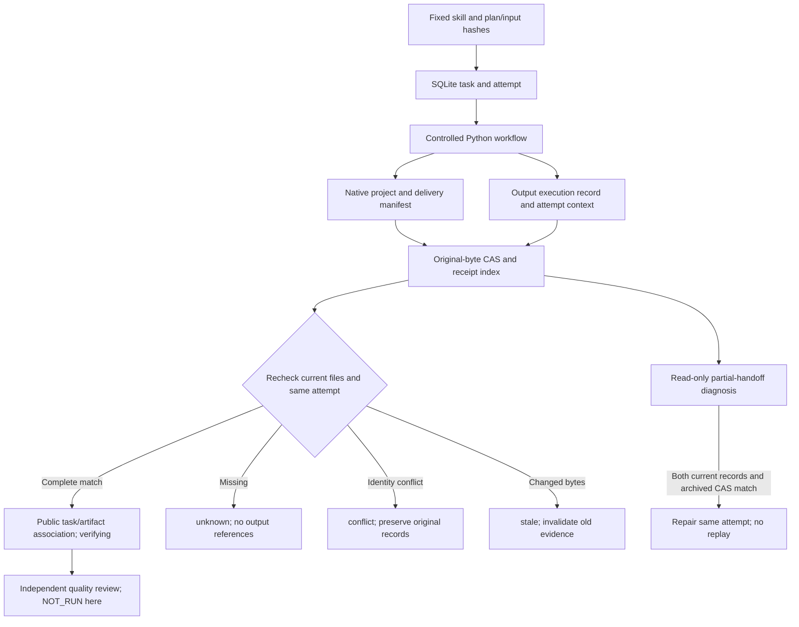

# FilmCraft receipt lineage and compatibility mapping

This change implements tasks 9.13–9.15 of `establish-v1-plugin` and the three FC-AR-001 receipt scenarios. Plugin dev.45 pins independent skills dev.42 / `7adfa763b161bc2ff7ef3efae702e285965bf23a`. Actual fixed installation is qualified separately after publication; full delivery and V1 remain open.

The native `.fcproj` owns editing data, SQLite tasks/attempts/leases own execution state, and independent quality evidence owns review conclusions. The index preserves original bytes in CAS and maps fields explicitly. It neither introduces a competing state authority nor promotes association to quality acceptance.

## Four existing formats

| Original format | Explicit mapping and checks | Missing fields and output semantics |
| :--- | :--- | :--- |
| `craft-command-receipt/v1` | planSha256 versus Python command hash; runtimeSha256, mode and inputs versus the fixed ledger binding; preserve native outcome separately | Command association only; do not invent historical task/attempt fields, emit delivery artifacts or promote task/quality state |
| `filmcraft-delivery/v1` | Runtime and source-project digest; assets/dependencies; reread each file; public/workflow identities from plan.json; fixed capabilities.json snapshot | A manifest may associate individually; without same-attempt output-execution the collection is unknown with no outputs |
| `craft-failed-stage/v1` | Preserve failure outcome and bytes; never follow arbitrary stage paths | Missing historical plan/runtime identities remain unknown; no replay or successful artifacts |
| `filmcraft-output-execution/v1` | Target, ownerPid, plan/input/project/runtime identities; compare optional context taskId, attemptId, sourceRevision and sourceTreeSha256 with the ledger | Missing historical context/PID remains unknown; mismatches are conflict; PID matching alone cannot establish attempt provenance |

The optional context is a compatible v1 addition. Standalone Python workflows still run without it and do not invent historical identity. The controlled Node adapter overrides inherited `FILMCRAFT_EXECUTION_CONTEXT`; the independent source rejects duplicate keys, unexpected fields and malformed values after asset preflight but before installation/output writes. Context is identity, **not authorization**; host scope enforcement and complete budget/cancellation control remain separate.

## Plan digest algorithms

Python reads strict JSON, rejecting duplicates/nonfinite values and preserving large integers. Each digest is SHA256 of UTF-8 bytes. JavaScript Number serialization must not rewrite original native receipts.

| Field | Python serialization |
| :--- | :--- |
| `fileSha256` | Original file bytes, no normalization |
| `commandPlanSha256` | `json.dumps(plan, sort_keys=True, allow_nan=False)`; default spaces and ASCII escapes |
| `workflowPlanSha256` | Same with `separators=(',', ':')`; ASCII escapes |
| `canonicalPlanSha256` | Compact/sorted with `ensure_ascii=False`; public task.planHash |

The ledger keeps public planHash and the corresponding nativePlanHash. Inherited assets bind through source project/delivery manifests; guard inputHashes cover only this plan.assets. Redacted public projections do not change original receipt bytes/digests. Public `craft-task/v1` and `craft-artifact/v1` are validated against the pinned ArtCraft owner; schemas are not copied.

## Queries, conflicts and partial handoff

Every `ReceiptIndex.collect(taskId, attemptId)` rechecks archived hashes, current receipts/candidates and ledger identity. A stored linked status cannot hide current unknown/conflict. Another digest of the same kind cannot overwrite the original SQL record or CAS. Same-name candidate replacement becomes stale; incomplete collections expose no output references. Ledger binding supplies query association and remains distinct from missing historical fields.

Handoff may stop between manifest and guard ingestion. Read-only recovery independently checks both current records and the archived subset. Only complete matching process/attempt evidence with a stopped process can diagnose executed. Repair writes to the same attempt without replaying Python/native commands and returns only to verifying. This bounded repair does not qualify complete recovery.

Public artifacts bind producerTaskId, immutable input versions, native project, dependencies/loss and evidence references. Technical, creative and user acceptance remain NOT_RUN; unknown media uses application/octet-stream without guessed codecs or quality.

Source red tests, regressions and post-publication fixed installation retain their own identities. Other platforms, static type checking, model routing, full authorization/budgets/cancellation, backup/rollback, moved packages/large-media boundaries, quality loops and full V1 remain open.

[Source candidate evidence / 源码候选证据](evidence/filmcraft45-lineage-candidate-20261008.json).

[Fixed installed acceptance / 固定安装验收](evidence/filmcraft45-fixed-lineage-20261008.json): tasks 9.13–9.15 complete; 39 native tests, 10 lineage cases, 13 preserved skills / 26 code files. Full V1 remains open.

## 2026-10-09 exchange-loss association candidate

For FC-AR-001/002, `ReceiptIndex` now checks the manifest lossReport identity and the exchange-loss report bindings to the current native project, reopening inspection file and every export. Missing historical report identity remains unknown. Malformed reports, identity conflicts, omitted or duplicate exports, lossy nativeSubstitute claims and promotion of unknown font/effect fidelity to observed produce conflict. Public artifact references and independent review remain blocked. Format losses must be explicit lost observations; association alone never promotes technical or creative acceptance.

Synthetic review, recovery and revision fixtures now carry explicit loss reports. A revision that changes native bytes also updates the loss report and manifest hashes. These fixtures only verify state gates. The native lineage executor now supplies the explicit resource budget required by the later controller; this does not establish a new fixed-installation or actual-export pass. Red evidence and source checks are recorded under `docs/evidence/filmcraft-artifact-contract-candidate-20261009/`. Full tasks 5.1–5.3 and 5.6 remain open; the existing dev.58 tag is unchanged.
