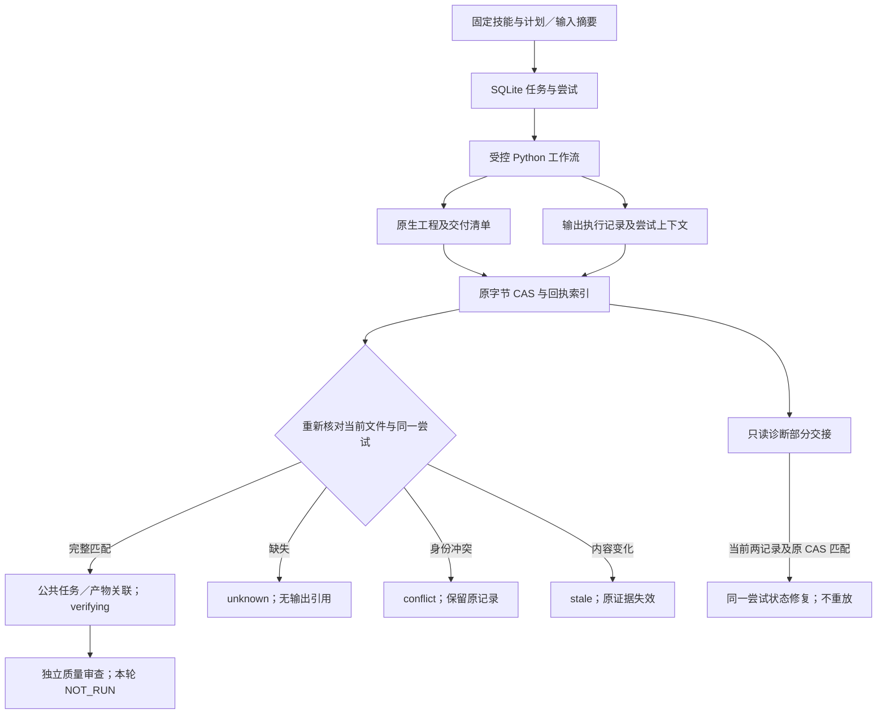

# FilmCraft 回执血缘与兼容映射

固定dev.59／源46／公开craft.5在macOS arm64隔离Codex／headless验收FC-AR-001/002全部8场景：13技能／62执行文件保全，10类血缘＋15类产物用例通过，2公共任务／26产物通过固定ArtCraft schema。135项安装回归全部通过、零跳过；源码83项Python／132项Node通过，3项声明环境检查由安装运行补证。OpenSpec5.1—5.3及5.6完成，完整V1剩35项。创作manual_review，用户／其他平台NOT_RUN。[固定证据](evidence/filmcraft59-fixed-artifact-contract-20261009/acceptance.json)。

以下保留历史检查点与候选演进。

本次变更对应 `establish-v1-plugin` 的 9.13—9.15 与 FC-AR-001 的三个回执场景。插件 dev.45 固定独立技能源 dev.42 / `7adfa763b161bc2ff7ef3efae702e285965bf23a`。固定安装验收在发布后另行记录；完整交付合同与 V1 仍开放。

原生 `.fcproj` 是编辑数据事实源，SQLite 任务／尝试／租约是执行状态事实源，质量评审证据另行拥有评审结论。回执索引保存原始字节 CAS 和显式字段映射，不新增任务状态权威，不把关联成功转换为质量通过。

## 四类旧格式

| 原始格式 | 显式映射与核对 | 缺失字段和输出语义 |
| :--- | :--- | :--- |
| `craft-command-receipt/v1` | `planSha256` 对 Python 命令摘要；runtimeSha256、mode、inputs 对固定账本绑定；结果单独保留 | 只建立命令关联，不虚构原生任务／尝试字段，不生成交付产物，不提升任务或质量 |
| `filmcraft-delivery/v1` | runtimeSha256、源工程摘要、素材与依赖；逐文件重读摘要；plan.json 的公共／工作流摘要；capabilities.json 的固定快照身份 | 单份清单可关联，但缺同尝试 output-execution 时集合为 unknown，输出引用为空 |
| `craft-failed-stage/v1` | 原始失败结果及字节；不沿 stage 字段读取任意路径 | 历史计划／运行时缺失保持 unknown；禁止自动重放，无成功产物 |
| `filmcraft-output-execution/v1` | targetHash、ownerPid、plan/input/project/runtime 身份；可选 context 的 taskId、attemptId、sourceRevision、sourceTreeSha256 对当前账本逐项匹配 | 历史 context 或 PID 缺失为 unknown；冲突为 conflict，PID 单独匹配不足以关联尝试 |

上下文字段是向后兼容的 v1 增量。独立 Python 调用不提供上下文仍可运行；不伪造历史身份。受控 Node 适配器覆盖继承环境中的 `FILMCRAFT_EXECUTION_CONTEXT`，独立技能源严格校验重复键、字段集合及格式，在素材预检后、安装或输出写入前拒绝畸形上下文。上下文是关联身份，**不授予授权**；宿主范围校验和完整预算／取消控制另行实现。

## 计划摘要算法

全部算法由 Python 读取严格 JSON，拒绝重复键／非有限数，保留大整数；对 UTF-8 字节计算 SHA256。不得以 JavaScript Number 重序列化原始原生回执。

| 字段 | Python 序列化 |
| :--- | :--- |
| `fileSha256` | 原始文件字节，无规范化 |
| `commandPlanSha256` | `json.dumps(plan, sort_keys=True, allow_nan=False)`；默认空格及 ASCII 转义 |
| `workflowPlanSha256` | 同上，`separators=(',', ':')`；ASCII 转义 |
| `canonicalPlanSha256` | 紧凑排序并 `ensure_ascii=False`；公共 task.planHash |

账本保留公共 planHash 与对应 nativePlanHash；工作流继承素材由源工程／交付清单绑定，输出 guard 的 inputHashes 只核对本轮 plan.assets。原回执字节及摘要不受公共脱敏投影影响。公共 `craft-task/v1` 与 `craft-artifact/v1` 仅从锁定 ArtCraft 所有者读取校验，不复制 schema。

## 查询、冲突与部分交接

`ReceiptIndex.collect(taskId, attemptId)` 每次核对归档摘要与当前原文件、候选文件及账本身份。先前 linked 不可掩盖当前 unknown/conflict。相同种类的新摘要拒绝覆盖原 SQL 记录和 CAS；候选被同名替换后返回 stale，任何不完整集合不暴露输出引用。关联记录附带账本绑定用于查询，与缺失的历史字段含义分开。

交接可能在清单入库后、guard 入库前中断。只读恢复诊断独立核对当前两份记录与已归档子集；齐备、同一进程／尝试且已停止才可诊断 executed。修复写回同一尝试，不重放 Python／原生命令，仅恢复至 verifying。检查、修复与完整恢复规范的验收范围仍分开。

公共产物映射绑定 producerTaskId、输入不可变版本、原生工程、依赖／交换损失及证据引用。技术、创作、用户接受保持 NOT_RUN；媒体类型未知时使用 application/octet-stream，不猜测编码或质量。

源码红灯、回归和发布后固定安装结果各自绑定版本保存。其他平台、类型检查、模型路由、完整授权／预算／取消、备份回退、移动包及大媒体边界、质量循环与完整 V1 继续开放。

[Source candidate evidence / 源码候选证据](evidence/filmcraft45-lineage-candidate-20261008.json).

[Fixed installed acceptance / 固定安装验收](evidence/filmcraft45-fixed-lineage-20261008.json): tasks 9.13–9.15 complete; 39 native tests, 10 lineage cases, 13 preserved skills / 26 code files. Full V1 remains open.

## 2026-10-09 交换损失关联候选

针对 FC-AR-001/002，`ReceiptIndex` 现在检查 manifest 的 lossReport 身份，以及 `exchange-loss.json` 对当前原生工程、重开检查文件和每个导出的摘要关联。清单缺失旧报告身份保持 unknown；畸形报告、身份冲突、遗漏导出、重复导出、有损 nativeSubstitute 或将未知字体／效果保真改称已观察，产生 conflict，禁止输出公共产物引用与进入独立质量审查。格式损失要求显式 lost，未知保真保持 unknown；关联本身不提升技术或创作验收。

合成评审、恢复和返工夹具增加明确损失报告；修改原生工程的返工夹具同时重新绑定报告及清单摘要，不沿用旧报告。此类夹具只验证状态门禁。原生血缘执行器补充后来必需的显式资源预算，尚未据此宣称新版固定安装或真实导出通过。红灯与源码检查记录位于 `docs/evidence/filmcraft-artifact-contract-candidate-20261009/`；5.1–5.3、5.6 完整合同仍开放，现有 dev.58 标签未改写。

后续原生执行发现实际输入可打包在交付根目录，不能按 assets/ 前缀识别输入。新增根目录素材红例后，校验改为只豁免已与账本输入版本／摘要匹配的打包依赖。修复后的源码候选真实执行 10 类血缘用例通过，1公共任务／13产物通过固定 ArtCraft schema；17项目标回归通过。失败候选与修复证据同时保留于同一证据目录；不是新固定安装或完整迁移验收，不关闭任务。

最终源码检查：79项Python、132项Node通过，3项原生环境明确NOT_RUN。另用真实原生输出构造9类回执负例，逐项拒绝后恢复清单／报告并核对原工程保全；不重跑原生操作。详见 followup-acceptance.json，仍不替代固定安装与完整合同验收。
