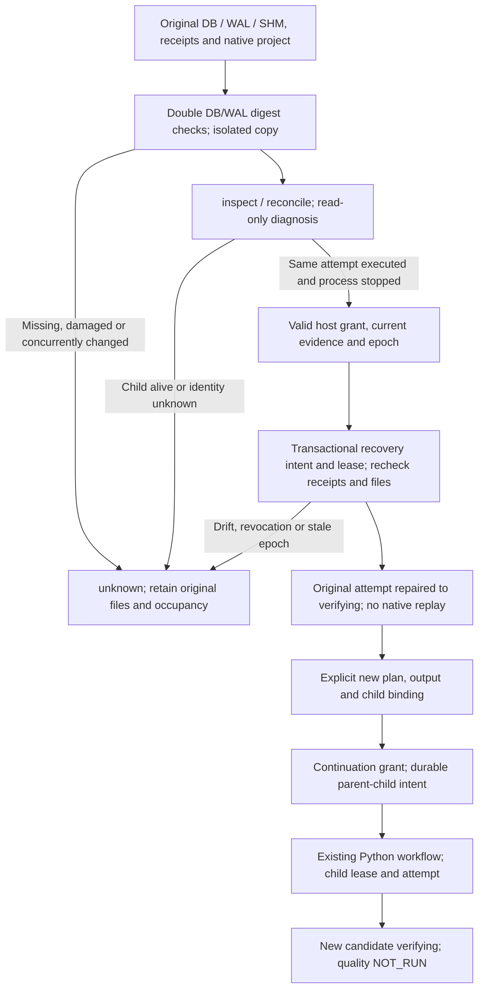

# FilmCraft read-only diagnosis, repair and continuation

[简体中文](FilmCraft-Recovery-Architecture.zh_CN.md). FC-TX-002 in `establish-v1-plugin` remains the behavioral authority; this page explains tasks 9.16–9.18. Candidate plugin dev.48 retains independent skills dev.42 / `7adfa763b161bc2ff7ef3efae702e285965bf23a` and their Python editing implementation. The source candidate passes 60 native/state tests without skips. Public-tag installed acceptance now passes all 60 tests and 14 matrix rows, completing tasks 9.16–9.18; complete Harness and V1 remain open.

`src/harness/forensic_snapshot.ts` reads original DB/WAL bytes and opens only a private copy for SQLite schema, integrity and logical checks. It neither opens the original SQLite connection nor reads/rebuilds original SHM. DB/WAL drift before or after observation rejects the snapshot. Fault tests compare original database, receipts, project and sidecar inventories/digests; a missing original is never created. Individual snapshot files are limited to 64 MiB; larger inputs remain unconfirmed.

`RecoveryService.repair` is separate from diagnosis. Original receipts/CAS, stopped process group, binding, epoch and current content must agree. The recovery intent commits before rechecking and applying. Two real repair executors produce only one applied intent. Repeated repair requires fresh diagnosis and reuses the original attempt/result; stale diagnosis is rejected. Lease expiry fences the former owner, while unknown process/result retains project occupancy.

`ContinuationService` accepts only an independently repaired verifying parent. The host supplies an explicit new plan, task/idempotency key and output root; the source hash must match the parent's current native project. Parent attempt/content, full child binding and original plan-file digest bind the continuation grant. Parent-child intent and child registration precede the existing Python workflow's new attempt. The original attempt never replays. Repeated continuation reuses the registered child, including the CLI path tested in the actual native sample. Unknown/running parents, or executed diagnosis without independent repair, are rejected.

## Authorization and CLI boundaries

`authorizationRef` and scope hashes are references, not grants. Mutations require a trusted host `Authorizer` or `LocalAuthorizationStore` reading separately maintained host/user records. Directories/files must belong to the current user, have no group/other access and no symlinks; ambiguous JSON is rejected. Records bind reference, scope, exact action/identity subject hashes and expiry. Each side-effect gate rechecks expiry/revocation. The CLI never creates grants. Valid grants within the same scope can be reused without repeated human confirmation.

`node src/cli/recovery.ts --help` lists actual arguments. `inspect` / `reconcile` need no write grant. `repair` requires fresh evidence, epoch and private authorization root. `continue` also requires child-binding, plan and runtime-home. `upgrade` / `rollback` require backup root and maintenance authorization. General public workflow admission, full authorization configuration and budgets remain independent open tasks; this release does not claim a complete permission executor.

## State compatibility and backups

| Ledger | Diagnosis | Mutation and rollback |
| :--- | :--- | :--- |
| Recognized schema 1 / 2 | Isolated read-only; no migration | Explicit backed upgrade to 3; preserve original records |
| Schema 3 | Isolated read-only | Current writer; rollback only when compatible with the original backup |
| Existing empty, unknown, foreign or logically damaged DB | unknown / reject | No claiming, initialization or overwrite |

`StateMaintenance` rechecks schema and all captured records under BEGIN IMMEDIATE, rejecting valid execution/recovery write leases. Before DDL it exclusively creates and fsyncs original DB/WAL, an SHM audit copy, digest manifest and upgrade intent, syncs the directory, then opens an isolated backup copy to verify records. A transaction adds schema 3 continuation_intents, plus recovery_intents for schema 1, retaining old tasks, attempts, receipts and unknown occupancy.

Rollback requires unchanged original four tables, no continuation records and recovery records matching the backup. It persists rollback intent before transactionally removing added structures. New tasks or changed records cause `rollback_changes_conflict`; new data is never discarded. Repeated completed rollback is read-only reuse. Actual installed dev.45 code rejects schema 3 with unchanged original file digests. Interrupted/revoked upgrade retains backups/intents for audit; retry upgrade needs a fresh backup directory. Automatic backup overwrite and native binary/runtime upgrades are outside this scope.

## Evidence and remaining gates

The source candidate covers 14 recovery matrix rows. Synthetic receipts/real SQLite faults, two real repair executors, an exited real host with a live controlled child, and actual Python/native continuation are labelled separately. Three public tasks and 26 artifacts validate against the pinned ArtCraft v0.1.0-dev.109 owner schemas, without copying schemas. Original byte digests and redacted public projection digests are recorded separately.

`scripts/verify_fixed_install.py` verifies the public-tag installation. `scripts/verify_fixed_recovery.py` executes its installed files with a fresh native runtime, then rechecks installation identities. Source or historical installs cannot substitute for current fixed acceptance. Complete Harness, public admission, budgets/cancellation, runtime upgrade/draining, independent technical/creative/user acceptance, other platforms and static type checking remain open. Verifying never implies quality or V1 completion.

[Source candidate evidence / 源码候选证据](evidence/filmcraft46-recovery-candidate-20261008.json).

Release correction: dev.46 installed tests passed all 60 cases, but relative collector output paths followed the installed child cwd and evidence aggregation failed. Dev.47 resolves all input/output paths before launching, with a target red test and destination/existing-evidence preservation regressions. The dev.46 tag/ZIP remains unchanged; complete installed acceptance runs against the new tag separately.

[Current dev.47 candidate / 当前源码候选](evidence/filmcraft47-recovery-candidate-20261008.json).

Observation-window correction: dev.47 passed 60 installed tests, but two fixtures queried the original ledger after their preservation assertions, changing SHM read marks before matrix capture; aggregation correctly refused acceptance. Dev.48 freezes matrix after-digests at the existing preservation assertion, before supplemental fixture SQL reads. Full DB/WAL/SHM byte comparison and refusal gates remain. The dev.47 tag/ZIP is unchanged.

[Current dev.48 source candidate / 当前源码候选](evidence/filmcraft48-recovery-candidate-20261008.json).

[Fixed dev.48 installed acceptance / 固定安装验收](evidence/filmcraft48-fixed-recovery-20261008.json).
