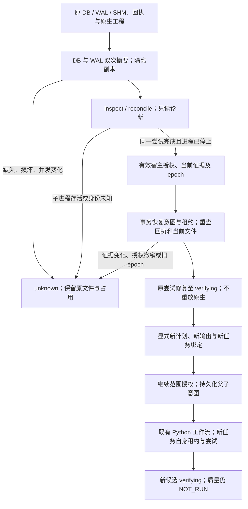

# FilmCraft 只读诊断、状态修复与继续执行

[English](FilmCraft-Recovery-Architecture.md)。行为事实源为 `establish-v1-plugin` 的 FC-TX-002；本页解释 9.16—9.18。插件候选 dev.47 保持独立技能源 dev.42 / `7adfa763b161bc2ff7ef3efae702e285965bf23a`，不修改固定技能中的 Python 编辑逻辑。源码候选 60 项原生及状态回归无跳过通过；发布后固定安装单独验收，任务在该验收完成前保持开放。

`src/harness/forensic_snapshot.ts` 只读取原 DB/WAL 字节，复制到私有临时目录后运行 SQLite 结构、完整性及逻辑检查；不打开原数据库连接，不读取或重建原 SHM。读取前后 DB/WAL 摘要不一致时拒绝旧快照。原库、回执、工程及 sidecar 的逐文件清单和摘要由故障测试比对；缺失原库不创建文件。副本单文件上限 64 MiB，超过上限保持未确认。

`RecoveryService.repair` 独立于诊断：原始回执与 CAS、进程组停止、任务绑定、epoch、当前内容必须一致，恢复意图先提交，之后再次核验并应用。两个真实执行者竞争时只有一个意图应用。重复修复需要新鲜诊断，复用原尝试和已应用结果；旧诊断拒绝。租约过期仅隔离旧所有者；未知进程或未知结果不释放工程占用。

`ContinuationService` 仅接受已独立修复至 verifying 的父任务。宿主提供明确的新计划和新任务／幂等键／输出目录，源工程摘要必须等于父任务当前原生工程。父尝试、父内容、完整子任务绑定和原始计划文件摘要共同绑定继续授权。父子意图和子任务先持久化，再通过既有 Python 工作流执行新尝试；原尝试不重放。重复继续调用复用已登记子任务，CLI 复用也经过实际原生样例核验。未知、仍运行或仅诊断为 executed 的父任务不能绕过独立状态修复。

## 授权与命令边界

`authorizationRef` 和 scope 摘要仅是引用，不能单独授予写入权限。写操作需要可信宿主 `Authorizer`，或 `LocalAuthorizationStore` 查询由宿主／用户单独维护的私有记录。目录和文件必须属于当前用户、无组／其他用户权限、无符号链接；重复 JSON 键拒绝。记录绑定引用、scope、精确 action/identity 主题摘要及有效期，撤销和到期在每个副作用门禁重新核验。CLI 不创建授权记录；同范围的有效宿主授权可复用，不要求重复人工确认。

`node src/cli/recovery.ts --help` 给出实际参数。`inspect` / `reconcile` 无写入授权要求；`repair` 要求新鲜诊断、epoch 与私有授权目录；`continue` 还需要 child-binding、plan 和 runtime-home；`upgrade` / `rollback` 需要备份目录及维护授权。普通工作流公共提交、完整授权配置与预算控制仍是独立开放任务，本轮不宣称完整权限执行器完成。

## 状态兼容与备份

| 账本 | 诊断 | 写入与回退 |
| :--- | :--- | :--- |
| 已识别 schema 1 / 2 | 隔离只读，不自动迁移 | 必须显式备份升级至 3；旧记录完整保留 |
| schema 3 | 隔离只读 | 当前写入；兼容条件满足才能回退至备份原版本 |
| 现有空库、未知版本、外来或逻辑损坏库 | unknown / 拒绝 | 不认领、不初始化、不覆盖 |

`StateMaintenance` 在 BEGIN IMMEDIATE 下重查 schema 和全部已捕获记录，拒绝有效执行／恢复写租约。DDL 前以独占文件创建、fsync、目录同步保存原 DB/WAL、SHM 审计副本、摘要清单和升级意图，并隔离打开备份核验逻辑记录。事务增加 schema 3 的 continuation_intents；schema 1 同时增加 recovery_intents，不改旧任务、尝试、回执及未知占用。

回退只允许原四表记录不变、无新增继续记录、恢复记录与备份一致的兼容状态；保存回退意图后按事务移除新增结构。已有新任务或记录变化返回 `rollback_changes_conflict`，不丢弃新数据。重复已完成回退只读复用。实际安装的 dev.45 代码拒绝 schema 3 且原文件摘要不变。升级中断／撤销留下的备份及意图保留审计；重复升级需新的备份目录，本轮不提供自动覆盖备份或二进制运行时升级。

## 证据与仍开放的门禁

源码候选覆盖 14 类恢复矩阵：合成回执和真实 SQLite 故障、两个真实修复进程、真实退出宿主及存活受控子进程、真实 Python／原生继续执行分别标注。公共映射的 3 个任务和 26 个产物经固定 ArtCraft v0.1.0-dev.109 所有者 schema 校验，不复制 schema。原字节摘要与脱敏公开投影摘要分别记录。

固定公开标签安装由 `scripts/verify_fixed_install.py` 验证，恢复矩阵由 `scripts/verify_fixed_recovery.py` 在实际安装目录执行并使用全新原生运行时；执行后复查安装身份。源码或历史安装结果不代替当前固定验收。完整 Harness、公共 admission、预算／取消、运行时升级排空、独立技术／创作／用户接受、其他平台与类型检查仍开放；本轮任何 verifying 均不代表质量完成或 V1 完成。

[Source candidate evidence / 源码候选证据](evidence/filmcraft46-recovery-candidate-20261008.json).

发行修正：dev.46 安装副本的60项回归通过，但恢复验收收集器使用相对输出路径时随子进程 cwd 改变而写错证据位置，报告未通过；dev.47 在启动前规范化全部输入／输出路径，新增明确红灯与目的地、已有证据保全回归。原 dev.46 标签与 ZIP 保持不变；完整固定验收使用新标签另行执行。

[Current dev.47 candidate / 当前源码候选](evidence/filmcraft47-recovery-candidate-20261008.json).
