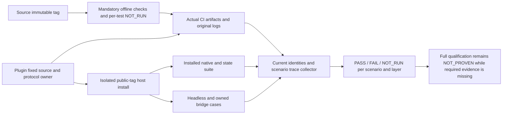

# Layered release qualification

OpenSpec9.28–9.30 implements FC-RL-001-LAYERED-CI and FC-RL-001-OPTIMIZATION-TRACE. Current candidate: plugin dev.52/source44. Complete V1, real media and exhaustive command/host/platform acceptance remain open.

The independent source has unconditional CI for metadata, local skill links, shared-resource synchronization, scenario/command catalogs and offline unit/entry contracts. A pinned test-ID policy requires every offline unit to pass; declared native environment cases remain individually NOT_RUN with reasons. Missing tests, unknown skips and conditional package checks fail. Failed subtests have an explicit parent FAIL and a separate failure-event count. Linux CI exposed malformed non-selected runtime lock entries being masked by unsupported-platform errors; source44 validates the complete lock before platform selection and any filesystem/network side effects.

Plugin CI unconditionally executes Python, Node, immutable vendor integrity, metadata and actual domain-object mappings against fixed ArtCraft schema bytes. Synthetic public task/artifact mappings and drift rejection verify protocol contracts only. Three declared native/media/previous-installed-core tests can be NOT_RUN in ordinary CI; all other skips fail. Fixed installation separately executes those tests with native dependencies. CI uploads original reports and logs even when checks fail.

`collect_release_layers.py` validates immutable source/plugin commits, complete declared file manifests, raw check-log hashes, actual GitHub job outcomes, current host discovery, installed regression and both capability modes. It derives optimization groups from the existing tasks index and verifies every scenario against the authoritative delta specs. Each record binds source/plugin/runtime, layer, host/platform/mode, inputs, candidate, expected/actual results and a hashed log envelope. Candidate or input drift cannot reuse another log, even within the same commit. Raw reports and logs remain byte-preserved. The collector reads no personal installation-directory file into public evidence.

Collection integrity PASS is separate from scenario qualification. Missing current scenario evidence remains NOT_RUN. Historical outcomes, overall counts, fixture scores and CI on Linux do not establish native Linux support. Real media remains NOT_RUN until separately sourced and tested; generated temporal/audio calibration stays synthetic. `--require-all` refuses complete qualification if any required record remains FAIL or NOT_RUN. Development prereleases remain outside the install marketplace; full V1 and creative/user acceptance are not implied.
