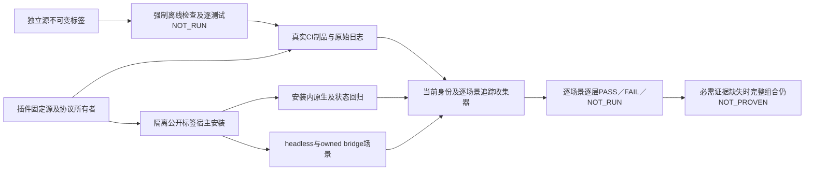

# 分层发行验收

OpenSpec9.28—9.30实现FC-RL-001-LAYERED-CI及FC-RL-001-OPTIMIZATION-TRACE。当前候选为插件dev.52／源44；完整V1、真实媒体、穷尽命令／宿主／平台验收保持开放。

独立源CI无条件核验元数据、单技能链接、共享资源同步、场景／命令目录、离线单元与入口合同。固定测试ID策略要求必需单元全部通过，声明的原生环境用例逐项NOT_RUN并说明原因；缺失用例、未知跳过和package条件绕过均失败。失败子测试明确保留父测试FAIL，单列失败事件数。Linux CI曾发现未选择平台的锁损坏被“不支持平台”遮蔽，源44现于平台选择及任何文件／网络副作用前核验完整锁。

插件CI强制执行Python、Node、不可变技能源完整性、元数据，以及真实领域映射对象对固定ArtCraft公共schema的验证。合成映射正例和漂移拒绝仅验证协议合同。普通CI可将三项已声明的原生／媒体／旧安装核心用例标NOT_RUN，其余跳过均失败；固定安装另行实际执行这些用例。检查失败也上传原始报告及日志。

`collect_release_layers.py`核对不可变源／插件提交、完整声明文件摘要、原始检查日志、真实GitHub作业结果、当前宿主发现、安装回归和两种能力模式。优化组直接读取现有tasks索引并逐场景对照权威增量specs；记录绑定源／插件／运行时、层级、宿主／平台／模式、输入、候选、预期／实际和带摘要的日志信封。同一提交中的另一候选或输入不能复用旧日志。报告和日志保持原字节，不将个人安装目录文件纳入公开证据。

收集完整性PASS与场景验收分开。缺少当前场景证据仍NOT_RUN；历史通过、整体数量、结构分数和Linux源码CI不代表Linux原生支持。真实媒体须另行明确来源并执行，程序生成时序／音频校准仍标合成。`--require-all`遇到必需记录FAIL或NOT_RUN时拒绝完整验收。开发预发布继续不进入正式安装市场，不推导完整V1、创作或用户接受通过。
