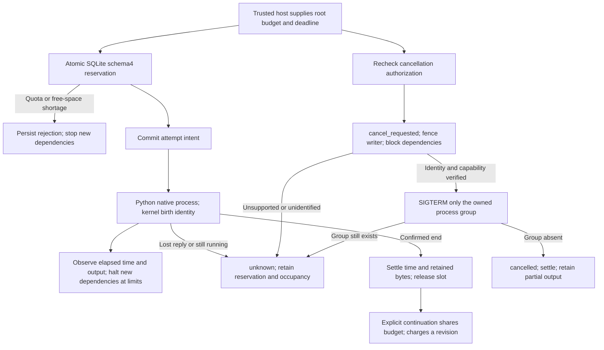

# FilmCraft resource reservations and cancellation

[简体中文](FilmCraft-Resource-Architecture.zh_CN.md). FC-TX-003 in OpenSpec `establish-v1-plugin` is authoritative for tasks9.19–9.21. This is a source candidate; fixed public-tag installed acceptance remains pending. Complete V1 remains open.

`ResourceController.reserve` stores the immutable root budget, reservations and parent-child scope in the existing operation ledger. No parallel JSON state authority is introduced. Amounts are `timeMs / diskBytes / outputBytes / slots / revisions`, all nonnegative safe integers, with positive time and slots. Repeated requests compare policy and reuse the original reservation. Unknown outcomes retain the complete reservation across restarts. Confirmed terminal tasks settle actual time/retained bytes and release slots; revision charges are never refunded. A crash between stop confirmation and settlement is recovered by repeated confirmation without another signal.

Children share the root budget/deadline and also respect an earlier child deadline. `ContinuationService` settles a parent only after independent recovery has confirmed its end, then creates a new task/attempt charging one revision. The runner never retries automatically. Saturated slots yield a deterministic refusal; hard time/disk/output/revision limits and free-space shortage persist a reason and prevent dependent dispatch.

Reservations commit before native editing. The runner observes time/output every100ms and again at exit. Even successful export exceeding a limit cannot reach verifying; projects and receipts remain. Runtime installation and capability preflight are separate setup gates and are not qualified by this budget. Observation is not an OS disk/CPU quota: a write can overshoot and unrelated processes can consume disk space. Limits stop new dependencies; an operation still running retains occupancy and cannot be reported stopped.

`CancellationService` persists a request first, fences active writer epochs and blocks the entire shared scope. Host authorization binds immutable root task/budget/deadline and is rechecked before a stop action. macOS uses libproc microsecond birth time plus boot time; Linux uses procfs start ticks plus boot ID. UID, executable and detached process group must agree. A reused numeric PID cannot authorize a signal; reparenting after host exit does not alter birth identity.

Only a supported, identity-matching owned POSIX process group receives SIGTERM. There is no automatic SIGKILL escalation. Missing identity, a live group, unreadable permissions or absent stop capability retains cancel_requested/unknown, occupancy and reservation. Only an absent group confirms cancelled; partial output is never deleted. Windows, native sessions escaping the controlled group, other platforms and complete public admission are not qualified.

`node src/cli/recovery.ts --help` documents actual arguments. `cancel` persists the request using a private host grant. `cancel-reconcile` observes completion and only attempts a supported stop with explicit `--signal` and valid authorization. The CLI never creates grants. Cancellation observation writes diagnostic state; it does not replace the existing read-only `inspect/reconcile`.

Schemas1/2/3 remain readable through isolated diagnosis and require explicit backed upgrade for schema4 writes. Migration preserves every old table record. Rollback compares all old records and requires newly added tables empty, refusing to discard budgets, cancellation or new tasks. Existing release tags and historical schema3 reports remain immutable.
