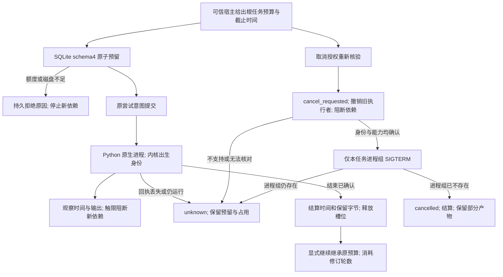

# FilmCraft 资源预留与取消

[English](FilmCraft-Resource-Architecture.md)。行为事实源为 OpenSpec `establish-v1-plugin` 的 FC-TX-003，任务为9.19—9.21。当前为源码候选，固定公开标签安装验收尚待执行；完整V1继续开放。

`ResourceController.reserve` 将根预算、预留和父子关系放入同一操作账本，不建立另一份 JSON 状态源。限额包含 `timeMs / diskBytes / outputBytes / slots / revisions`，均为非负安全整数，时间与槽位必须为正。重复请求核对原策略并复用原预留。结果未知时保留完整预留，重启不能重置；已确认终态按实际时间/保留字节结算，槽位释放，修订轮数不退回。停止已记账而结算中断时，重复确认补齐结算，不再次发送信号。

父子调用共用根预算和截止时间；子任务更早的截止时间也生效。`ContinuationService` 在独立恢复确认父尝试结束后结算父预留，再以新任务、新尝试继续，并消耗一轮修订。执行器不自动重试。槽位暂满有确定拒绝结果；时间、磁盘、输出、修订硬限和可用空间不足记录原因并阻断后续依赖。

原生编辑前提交预留；执行期间每100ms观察时间和输出，结束时再观察。超限任务即使导出成功也不能进入 verifying，工程/回执仍保留。运行时安装与能力预检属于独立 setup 门禁，此预算不声明它们受控。监测不是操作系统级磁盘/CPU配额：单次写入可能超过限额，其它系统进程也可能耗尽磁盘；触限后停止新依赖，尚未结束的原生操作继续占用资源，不能伪称已停止。

`CancellationService` 先持久化请求，撤销活动执行者的 epoch，并阻断整个共享预算域。宿主授权绑定不可变根任务、预算与截止时间；发送停止动作前重新检查授权。macOS 使用 libproc 的微秒出生时间和启动时间，Linux 使用 procfs 的启动时钟与 boot ID，并核对UID、执行文件和独立进程组。PID相同但出生身份不同不能发送信号；宿主退出导致 reparent 不改变出生身份。

只有声明支持停止且身份一致的本任务 POSIX 进程组可接收 SIGTERM；不自动升级SIGKILL。缺少身份、组仍在运行、权限不可读或无停止能力时保留 cancel_requested/unknown、工程占用和预留。进程组不存在才记录 cancelled，不删除部分产物。Windows、脱离受控进程组的原生子会话、其它平台与完整公共 admission 均未由本实现验收。

`node src/cli/recovery.ts --help` 提供实际参数：`cancel` 仅持久化请求，需私有宿主授权；`cancel-reconcile` 观察结束状态，只有显式 `--signal` 才尝试受支持停止，并需有效授权。CLI不创建授权记录。该观察会写取消诊断，不替代原有只读 `inspect/reconcile`。

schema1/2/3 可隔离只读诊断，写打开要求显式备份升级到4。升级保留全部旧表记录；回退核对所有旧记录及新表是否为空，有预算/取消/新任务记录则拒绝丢弃数据。旧发布标签和历史schema3验收报告保持不变。
