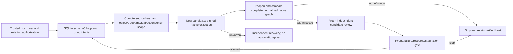

# Bounded local revision

FC-QA-002, OpenSpec9.25–9.27. Fixed dev.51/source42 public-tag installed qualification passes for this bounded scope. The complete V1 remains incomplete.

`RevisionService` persists immutable policy and contiguous rounds in the existing operational ledger. One root owns one policy; restarting or changing limits cannot reset counters. schema1–4 require explicit authorized, verified backup upgrade to schema5. Rollback refuses new records rather than discarding them. Older implementations reject the new schema.

The first compiler supports existing clip speed/duration/reverse and absolute audio gain. It refuses ripple, new dependencies, arbitrary commands, structural fields and unsafe native numeric IDs. Scopes bind sequence, track, object, decimal tick interval, editable leaf pointers and dependency hashes. The original source hash is checked before admission and dispatch. New outputs cannot overlap source outputs. Only verified packaged-media relocation paths are normalized; all remaining native graph fields and dependency identities must remain unchanged outside permitted leaves. The requested native values must actually be present.

Every new candidate requires its own frozen request and independent receipt. Engineering and every required rubric dimension must pass before it can be a verified best. A high score cannot override failures. Ties preserve the earlier best. Stale artifacts invalidate their evidence. If none qualifies, best is explicitly null. Creative/manual and user acceptance remain separate; a best candidate does not imply user acceptance.

The trusted host must call `invalidateCriteria` when the current goal or rubric changes. This permanently fences dispatch and removes the old best recommendation; it does not silently widen policy or allocate a fresh loop. Same-scope rounds reuse the original authorization reference and shared resource scope. Broader changes require a new explicit authorization scope.

Unknown attempts only observe or enter independent recovery. Round count, failure count, shared budget and stagnant progress stop dispatch. The host receives unresolved issue IDs and quality dimensions plus current independently revalidated best references. POSIX process controls are the existing boundary; this is neither an OS sandbox nor full cross-platform qualification. The revision coordinator currently exposes a programmatic host interface; full user-decision UX and general creative revision routing remain open.

Fixed dev.51/source42 qualification now passes; evidence: [fixed report](evidence/filmcraft51-fixed-revision-20261008.json). This completes only OpenSpec9.25–9.27;54 V1 tasks remain.
