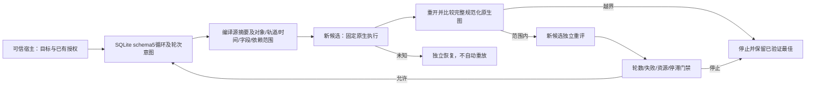

# 受限局部修订

对应FC-QA-002、OpenSpec9.25—9.27。dev.51／源42公开标签固定安装的本专项验收已通过，完整V1未完成。

`RevisionService`在现有唯一操作账本中持久化不可变策略和连续轮次，一个根任务仅有一套策略，重启或改变限额不能清零计数。schema1—4须经显式授权、核实备份后升级到schema5；兼容回退遇到新增记录时拒绝丢弃。旧实现拒绝新schema。

首批编译器支持现有片段速度／时长／反向及绝对音频增益；拒绝ripple、新依赖、任意命令、结构字段和不能安全表达的原生数值ID。范围绑定序列、轨道、对象、十进制tick区间、可编辑叶字段与依赖摘要，登记和派发前检查原工程摘要，新输出不能与来源重叠。仅对经摘要核实的打包媒体路径迁移规范化；其余完整原生图中非目标字段与依赖身份均须保全，目标值必须实际生效。

每个新候选必须有自己的冻结请求和独立回执，工程验收及所有必需rubric维度通过才进入已验证最佳。高分不能覆盖失败；同分保留较早候选，作品变化使证据失效，没有合格候选时最佳明确为null。最佳不代表创作或用户接受。

可信宿主收到当前目标或rubric变化后必须调用`invalidateCriteria`，永久停止旧循环派发并撤销旧最佳推荐，不自动扩展策略或获得新循环额度。原范围内轮次复用原授权引用和共享预算，扩大范围须有新的显式授权。

未知尝试仅观察或进入独立恢复。轮数、失败、共享资源与无改善门禁阻止继续派发，输出未解决问题ID、质量维度和重新核验的最佳引用。进程控制沿用POSIX边界，不等于OS沙箱或跨平台验收。当前提供程序化宿主接口，完整用户决策交互及通用创作修订路由仍开放。

固定dev.51／源42专项验收已通过，见[固定证据](evidence/filmcraft51-fixed-revision-20261008.json)。仅完成OpenSpec9.25—9.27，V1余54项开放。
