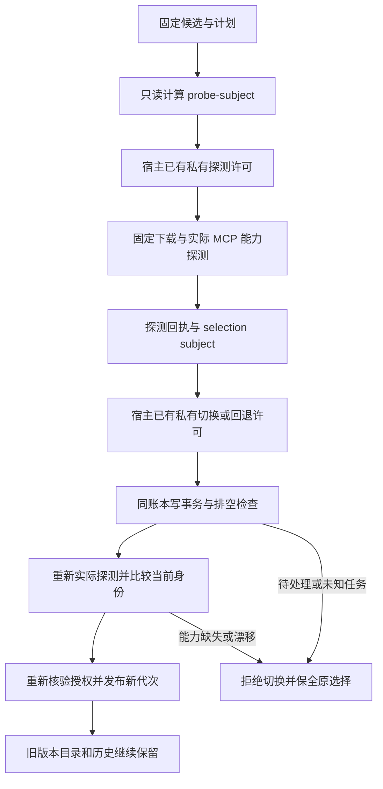

# FilmCraft 运行时升级入口

dev.61 源码候选提供 `src/cli/runtime.ts`。技能源仍是独立发布的快照，原生二进制仍由技能的固定锁安装器核验并并排保留。运行时选择位于同一 schema6 操作账本；schema1—5 写入前继续使用已有 recovery upgrade 的显式授权与完整备份流程。

候选 JSON 使用 `schema: filmcraft-runtime-candidate/v1`，并提供 `skillDirectory`、`sourceRevision` 和 `sourceTreeSha256`。宿主从已核验的固定安装获取这些身份；文件中的自声明不是许可。运行时版本、二进制摘要和来源从该技能的 runtime.lock.json 读取；兼容状态 schema 由当前适配器限定为6，不接受调用者自填可用状态。

`probe-subject` 只读计算探测主题；`probe` 需要匹配的已有私有宿主许可，才下载、核验并启动只读原生探测，输出 `filmcraft-runtime-upgrade-probe/v1`。主题绑定规范账本路径、当前代次、运行时目录、完整技能源、原生锁、计划原字节、Python路径及二进制摘要和预检器摘要。每个计划的资源需求仍由实际原生上下文检查；目录存在不等于编辑或导出已验收。

`subject --probe FILE` 计算切换许可主题；`activate --probe FILE` 使用该已有许可，在同一写事务中检查排空并重新探测。`subject --probe FILE --generation N` 和 `rollback --probe FILE --generation N` 使用回退动作许可，且候选必须匹配保留历史的原版本身份；新的实际探测摘要仍写入新代次，旧记录不改写。回退探测必须在当前代次重新采集，不能重放升级前的旧回执。

所有命令共有参数：`--candidate FILE --plan FILE --ledger FILE --runtime-home DIRECTORY [--python FILE]`。有副作用的命令另需 `--authorization-root DIRECTORY --authorization-ref REF --authorization-scope-sha256 SHA`。CLI 不创建宿主许可，不重试编辑，不删除旧原生版本，不自动处理未知任务。当前入口明确仅探测 headless 领域计划；bridge 的桌面身份与逐命令验收继续由既有能力合同管理。

已知缺失能力通过 `capability_missing`、证据不足通过 `capability_unknown`、参数或身份漂移通过各自稳定错误码拒绝。未知的 Python/原生输出保持 `native_preflight_failed`，不把堆栈或本地路径作为公共合同返回。

该入口及源码原生切换证据不代替固定发布安装、故障恢复、全平台或完整 FC-RT-002 场景验收。2.4—2.6 在这些门禁完成前保持开放。

能力拒绝附带可选 `diagnostic`：`filmcraft-capability-refusal/v1` 标明字段、状态、可确认的预期和实测值及当前快照摘要。参数只返回摘要；未知值为 null，本地路径与任意原生文本不回显。Node 校验字段和拒绝码对应状态，不接受额外字段。该信息仅解释阻断原因，不证明资源可执行或创作验收通过。
