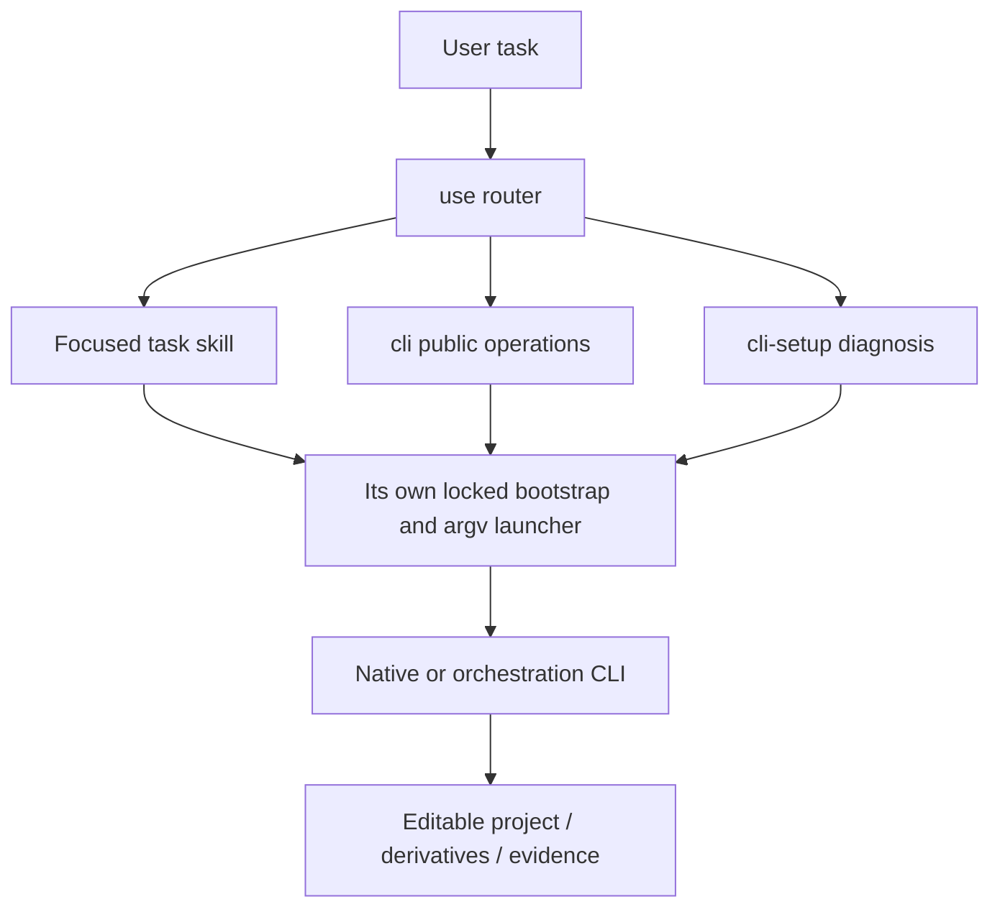
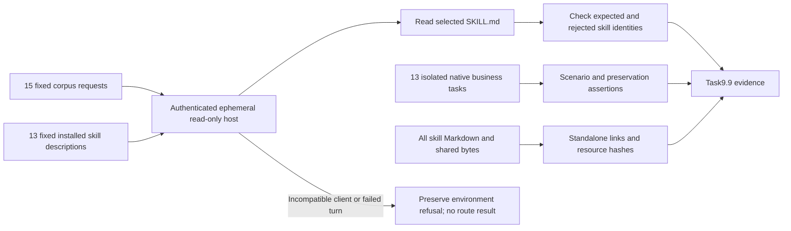

# FilmCraft Skill Suite Architecture

> Updated: 2026-10-09. Current release dev.76 retains source dev.57/native CLI0.2.0-craft.5 and13 skills. Routing evidence remains fixed75-bound; fixed76 maintenance root qualification requires the stated owned temporary environment. Older dev.6 checkpoints retain their identities and do not qualify full permissions, all command contexts or host release acceptance.

## 1. Why a suite

The original single use skill gave a working bootstrap and representative native workflow, but had broad discovery and insufficient task routing. The revised suite follows Dreamina's entrypoint / CLI / setup / task pattern, with command groups derived from the inspected source and actual installed runtime. It does not create fake auth or generation interfaces. This package contains13 skills.

## 2. Responsibilities and routing

| Skill | Task boundary |
| :--- | :--- |
| `filmcraft-use` | use |
| `filmcraft-cli` | cli |
| `filmcraft-cli-setup` | cli setup |
| `filmcraft-cli-project` | cli project |
| `filmcraft-cli-media` | cli media |
| `filmcraft-cli-timeline` | cli timeline |
| `filmcraft-cli-audio` | cli audio |
| `filmcraft-cli-subtitles` | cli subtitles |
| `filmcraft-cli-color` | cli color |
| `filmcraft-cli-motion` | cli motion |
| `filmcraft-cli-export` | cli export |
| `filmcraft-cli-multicam` | synchronized camera switching and primary-audio preservation |
| `filmcraft-cli-transcript` | speech recognition or timed-text import and editable captions |



## 3. Single-skill packaging and CLI lifecycle

Each skill contains its own necessary scripts, runtime locks, workflow reference and examples. There are no sibling-directory reads or symlinks. `scripts/sync_skill_suite.py` copies canonical executable resources from the use skill during source maintenance; `--check` rejects drift. Scenario descriptions and command evidence remain individually maintained. This duplicates distribution resources to support granular installations while avoiding multiple hand-edited implementations.

The launcher accepts native argv after `--`, validates the leading subcommand before installation, invokes a fixed checksummed executable without a shell, preserves exit status and bounds waiting. Unknown operation/platform/corrupt install fails. Native parameters, command IDs and enabled state are discovered at runtime. Output timeouts are unknown results, not proof that writes never happened. Save a native checkpoint and inspect before any replay.

## 4. Source evidence and differences

Research checkout: `storytold/filmcraft` at `adfd9a66de2bebc764c7f57435ccdf0f1d2e1df6`. CodeGraph indexed 689 files, 20278 nodes and 97560 edges. CLI parser and engine dispatch were investigated separately from installed command catalogues; current source and release binary may differ. See [research evidence](evidence/upstream-codegraph.json).

FilmCraft uses tick-based timeline commands and save/save-as; EffectCraft has comp/layer property paths and render channels; PhotoCraft has ordered run flags and persistent serve; VectorCraft uses ordered run/export steps and distinct artboard/range indices. Upstream ArtCraft is a Tauri scene/generation application with scene asset persistence and asynchronous provider task notifications. Our ArtCraft CLI is the existing local DAG/ledger runtime, implemented independently; no upstream ArtCraft code or branding assets are copied.

## 5. Validation and release

`tests/test_skill_suite.py` isolates every skill, verifies CLI discovery and catalogue subsets against the pinned runtime, and refuses unsupported subcommands before creating a runtime directory. Existing native workflow suites verify editable delivery and revisions. Individual discovery success does not prove all task commands, creative quality, GUI or cross-editor fidelity. Shared resources are checked and each SKILL.md validated; native/platform and host results are reported separately.

Run from the independent skill repository:

```bash
python3 -B scripts/sync_skill_suite.py --check
python3 -B -m unittest discover -s tests -p test_skill_suite.py -v
CRAFT_LIVE_SUITE=1 python3 -B -m unittest discover -s tests -p test_skill_suite.py -v
```

Install one skill with `npx skills add full-aigc-skills/filmcraft-skills --skill <skill-name>`; invoke its actual absolute directory, not a sibling path. Plugin packaging must bind the complete suite to a fixed source tag, commit and per-skill digest. Former tags remain immutable, and existing use/workflow payloads stay compatible.

## Historical dev.6 maintained-runtime installed-scene verification

Plugin dev.6 / skill source dev.5 now have separate evidence for maintained CLI 0.2.0-craft.1: all eight project, media, timeline, audio, subtitle, color, motion and export scenes pass (43.688 seconds). Each actual installed task skill is copied alone with its own fresh public-download runtime and system-only subprocess PATH. The base project is generated separately by the installed use skill and is preserved. Native assertions include reopens, unchanged tracks, decoded gain, caption timing, embedded LUT after source removal, keyframe pixels and video/interchange export. The report binds installed skill hashes, the test driver, generated input/project fingerprints, native binary and output fingerprints. All 58 installed skill hashes remain unchanged. Default regression has 32 passes and 12 gated skips among 44 tests; it does not replace the eight native cases. Historical 0.2.0 proof remains valid only for its original version. [Evidence](evidence/maintained-runtime-task-first-use.json). No skill bytes, native release or plugin version changed for this QA increment; creative, model and actual generic installer gates remain open.


## Fixed75 routing and business acceptance

All15 independent ephemeral read-only host turns select and actually read the expected fixed skill. The host uses existing authentication and default gpt-6-astra configuration; expected labels are never sent to the model. Existing client0.162.0-alpha.2 works; client147 model-version refusal is preserved. No tools are upgraded and no credentials copied. Connection-scoped extra roots target the actual installed skill bytes and source skill names; other hosts and full plugin namespace qualification remain FC-RL-001 work. All13 independent native businesses pass in102.290s;232 Markdown files/337 local links stay inside each skill, with deterministic resources matching source57. Only9.9 closes;7 tasks remain. [Acceptance](evidence/filmcraft75-fixed-skill-routing-20261009/acceptance.json).



Repeatable driver: `scripts/verify_host_skill_routing.py --codex CLIENT --installed-plugin FIXED_ROOT --source-repository SOURCE_GIT --output NEW_PRIVATE_DIRECTORY`. The corpus is read from the installed lock's immutable skill-source Git object. Host selection and native business results remain separate.
