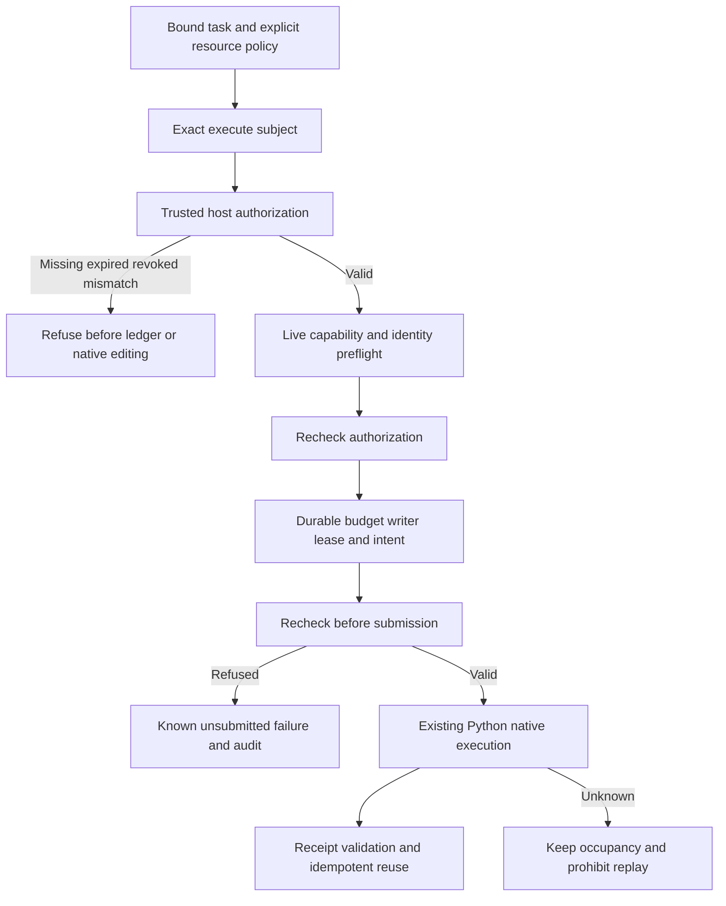

# Initial workflow host admission

`src/cli/workflow.ts` and `WorkflowAdmission` admit initial Harness workflows. The internal Python adapter, standalone skills, recovery, continuation and bounded revision retain their separate contracts.

`subject --binding FILE --resources FILE` reads an exact subject without creating a grant. `run` additionally requires `--plan`, `--ledger`, `--blobs`, `--authorization-root`, `--runtime-home` and `--resources`; optional `--source` and `--python` preserve existing adapter semantics. Resources use the existing `limits`/`allocation` contract and are bound to authorization.

A trusted host query or private `filmcraft-local-authorization/v1` grant supplies authority. The subject binds the complete task, canonical output, source revision/tree, input/project/plan/runtime identities, deadline, authorization scope and resource policy. References inside a plan never grant permission. Immutable authorization requests and independent task/resource snapshots prevent caller mutation from changing the approved execution.

Existing valid scoped grants are reused without repeated human confirmation. Revoked grants refuse even idempotent reuse. Authorization does not bypass live identity, capabilities, resources or writer exclusion. Native completion remains verifying; technical, creative and user acceptance stay separate. Unknown outcomes retain existing reconciliation and recovery gates.

Seven units include CLI read-only subjects and refusal before ledger creation. `scripts/verify_workflow_admission.ts` executes seven actual-native cases using explicit private QA host grants, not production authorization. The project-change probe substitutes another valid project saved by the native runtime; it does not claim GUI automation. [Candidate evidence](evidence/filmcraft55-admission-candidate-20261009/report.json). Full TX-001, all host dispatch paths and complete V1 remain open.

dev.56 independently verifies adapter raw-byte tree and vendor file-digest tree identities, with explicit algorithm labels. Fixed dev.55 passed seven native cases but failed final qualification because its verifier mixed these algorithms. Failure evidence and the old tag are preserved; fixed dev.56 acceptance is pending, with no task closed.

Fixed dev.56/source46/craft.5 passes seven actual-native host admission cases, preserving13 skills and all executable identities. OpenSpec3.1 and3.2 tests/minimum implementation are complete; full version-binding/writer acceptance3.3, other dispatch paths/platforms and full V1 remain open, with46 tasks remaining. The dev.55 verifier failure is preserved. [Evidence](evidence/filmcraft56-fixed-admission-20261009/report.json).
