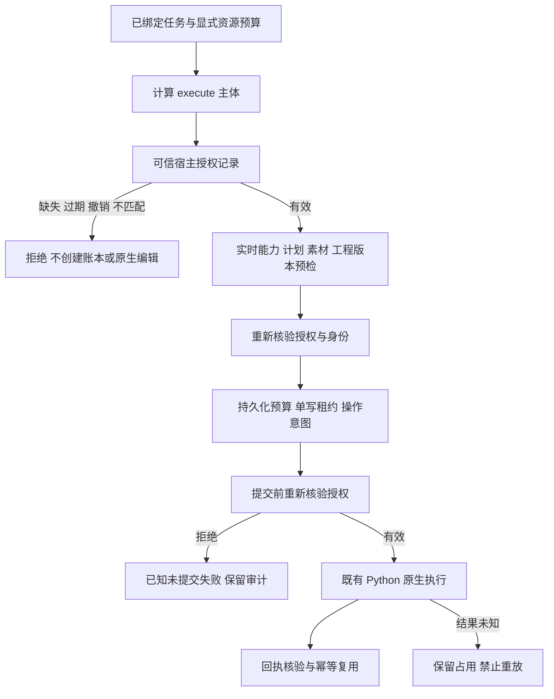

# 首次工作流的宿主授权准入

`src/cli/workflow.ts` 与 `WorkflowAdmission` 是 Harness 首次执行入口。`PythonWorkflowRunner` 保留内部适配职责；独立技能、恢复、继续和受限修订仍保留各自合同，不把它们冒充已通过本入口的宿主请求。

`subject --binding FILE --resources FILE` 仅输出授权主体，不创建授权。`run` 必须另外指定 `--plan`、`--ledger`、`--blobs`、`--authorization-root`、`--runtime-home` 与 `--resources`；可指定 `--source` 和 `--python`。预算 JSON 使用既有 `limits`／`allocation` 结构，不能在授权后替换预算。

授权由宿主预先维护的私有 `filmcraft-local-authorization/v1` 记录或可信查询器提供。主体覆盖完整任务（计划/素材/原工程版本/固定来源/实际运行时/输出/截止时间/授权范围）与资源预算，输出路径规范化。原计划中的 `authorizationRef` 仅是引用；不创建授权、不接受素材元数据授予权限。查询器接收不可变授权请求和主体，执行使用独立任务及预算快照。

有效同范围授权持续复用，不要求重复人工确认。撤销后包括幂等复用请求也被拒绝。授权通过仍须通过能力、身份、预算与单写检查；执行结束仍为 verifying，不提升技术、创作或用户接受状态。未知结果沿用原有 reconciling 和恢复门禁。

验证：7项准入单元包含 CLI 只读主体与无授权不创建账本；`scripts/verify_workflow_admission.ts` 运行7个实际原生场景，显式私有QA授权从本机宿主存储读取，未使用生产授权。原工程变更探针使用另一个实际原生保存的有效工程版本，未宣称 GUI 自动化。候选证据见 [报告](evidence/filmcraft55-admission-candidate-20261009/report.json)。完整 TX-001、所有宿主调用路径和完整V1验收继续开放。

dev.56 分别核验适配器原字节树摘要与 vendor 文件摘要树身份，并显式标注算法。固定dev.55的7项原生场景通过，但最终验证器混淆算法而FAIL，失败证据与旧标签保留；dev.56固定验收待执行，未关闭任务。
