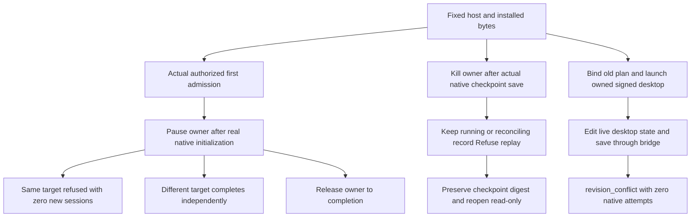

# Actual version-binding and writer boundaries

`verify_writer_boundaries.py` covers all five FC-TX-001 scenarios. It verifies the actual isolated host receipt, immutable tag,13 skills and every executable file, then runs installed first-admission verification. Media, grants and runtime caches stay private.

The scheduling probe subclasses and delegates to the original Session, pausing after actual initialization or successful native `file.saveAs`. Every native request uses the existing implementation; installers and installed payload files are unchanged. Traces bind session starts, native reply digests and owned process identities. Canonical-parent aliases test contention; existing user-directory listings and bytes are preserved.

SIGKILL terminates only the test owner. Persistent occupancy and staged projects remain. Retry must report `output_execution_reconciling`; releasing an OS file lock never grants safe replay. A separately requested read-only checkpoint reopen proves preservation and is not an editing replay. Cleanup only concerns owned test processes, without deleting projects, records or stages.

Desktop identity, signature and owned loopback listener are verified before opening a private project, creating a sequence and saving in the actual desktop through its bridge. A previously bound, still authorized plan must return `revision_conflict`, create zero native attempts and preserve the desktop-saved bytes. This does not claim manual UI clicks.

[Candidate QA of fixed dev.56](evidence/filmcraft57-writer-candidate-20261009/report.json) covers five scenarios. The initial probe tool-route failure is retained separately. New fixed dev.57 verification is pending. Scope is current macOS arm64/Codex/headless/owned signed desktop; other hosts/platforms, complete task recovery and full V1 remain open.

The extended actual CLI probe additionally rejects seven independently granted identity mismatches: planHash, nativePlanHash, inputHashes, projectRevision, sourceTreeSha256, sourceRevision and runtimeIdentity. Each returns its specific conflict with zero native attempts and no delivery. [Extended evidence](evidence/filmcraft57-writer-candidate-20261009/binding-dimensions-report.json).
