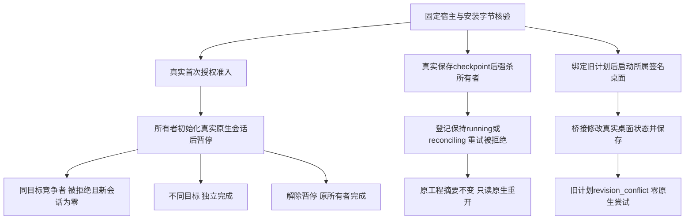

# 版本绑定与单写的真实边界验收

`verify_writer_boundaries.py` 验证 FC-TX-001 的全部五个场景。它先核对真实隔离宿主回执、固定标签、13项技能和全部执行文件，再调用固定安装的首次授权准入验收。用户媒体、授权文件和原生缓存不进入公开证据包。

调度探针 `probe_workflow_writer.py` 仅对原 `Session` 做继承与委托，在真实初始化后或真实 `file.saveAs` 成功后暂停。每个原生请求都由既有实现执行，安装器和13项技能文件未改写。进程轨迹记录会话启动、实际回复摘要、所有者及原生PID。测试通过规范化父目录的别名竞争，检查现有用户目录的清单及摘要未变。

中断探针用 SIGKILL 终止自身所有者，保留原登记和暂存工程；后续请求必须返回 `output_execution_reconciling`，不能把文件锁释放视为安全重放。只读重开是另外明确发起的诊断会话，不是重放编辑。清理仅针对本测试创建的进程，不删除工程、登记或暂存。

桌面探针核对签名应用版本和二进制摘要，以私有数据目录和所属loopback监听启动。通过真实桌面的桥接接口打开工程、新建序列并保存，再提交此前已绑定、仍获有效授权的计划。要求返回 `revision_conflict`、尝试数为0且桌面保存后的工程摘要不变；不宣称人工UI点击。

[固定dev.56的候选QA证据](evidence/filmcraft57-writer-candidate-20261009/report.json)包含五个场景；首次探针误用工具名的失败单独保留。新dev.57复验待执行。覆盖范围是当前 macOS arm64、Codex、headless和所属签名桌面；其他宿主／平台、完整任务恢复及完整V1继续开放。

补充实际CLI验证七类已获精确测试授权但身份不符的请求：planHash、nativePlanHash、inputHashes、projectRevision、sourceTreeSha256、sourceRevision与runtimeIdentity。每类返回对应冲突，原生尝试为0且未创建交付。[补充证据](evidence/filmcraft57-writer-candidate-20261009/binding-dimensions-report.json)。
