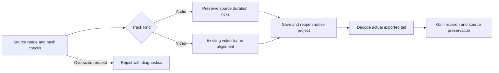

# FilmCraft audio sample duration correction

Status: maintained runtime 0.2.0-craft.3 published; source public cold-use and decoded-export checks passed. Fixed Film34/Art104 installed distribution and representative revisions pass. The normative scenario is FC-DM-002-AUDIO-SAMPLE in establish-v1-plugin.

## Problem and behavior

At 12 fps, a 2.20-second audio source is rounded down to approximately 2.167 seconds. The exported 2.17–2.20-second tail has RMS 0.000392 despite a continuous source tone. Saving a project does not establish complete audio preservation. The preceding range-validator correction accepted legitimate upward frame padding but did not change native downward truncation.

The native make_track_item patch retains requested integer source ticks for audio tracks. Video tracks retain nearest-frame alignment and the minimum one-frame rule. Caption font, sequence rate, collection and relinking patches remain included. Explicit oversized source requests still fail in the skill. Existing projects reopen with their recorded clip durations; historical edits are not rewritten automatically.

## Build and evidence boundaries

Export the fixed upstream commit to a temporary copy and verify the combined patch before building. Research stays read-only. The maintained runtime is 0.2.0-craft.3; previous immutable releases remain available. Native assertions cover 12 fps and 24000/1001 fps, source in-points, unchanged video quantization, one sample, 2.20 seconds and 2.211333 seconds.

Actual cold-use and native unit red cases were reproduced. Isolated Python builder and tampered-patch rejection tests pass. Source regression passes 161 tests with 33 conditional skips. Final bound evidence must establish native build, decoded-tail green results, public installation, fixed Film packaging and Art distribution; compilation alone cannot replace these gates.

## Asset preflight and public verification

FC-TX-004 already requires validation failures to avoid recovery directories. A corrupt sequence was rejected but left a recovery directory. Pure asset preflight now checks paths, hashes and sequence frames before runtime installation or staging. Copy-time checks remain to detect later changes. Native execution failures still retain staged projects. The sequence test keeps its no-output assertion. The original representative test strengthens pure digest failures to require no recovery directory while retaining failure.json and source-preservation assertions for native editing failures.

Native 106 tests, two actual public audio-tail/gain tests, sequence relocation/revision and the original short-film task passed. Bound evidence: docs/evidence/filmcraft-audio-sample-source-public-20261007.json. Fixed distribution evidence: docs/evidence/craft-art104-sample-audio-fixed-first-use-20261007.json. Only FC-DM-002-AUDIO-SAMPLE closes; full V1 and generic Skills CLI remain open.
