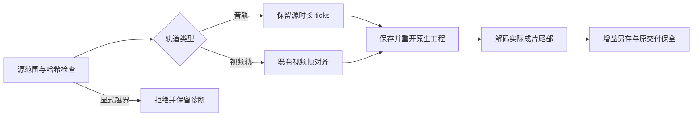

# FilmCraft 音频采样时长修复

状态：维护运行时 0.2.0-craft.3 已公开发布，源技能公开冷安装与实际成片验收通过；固定插件／Art 分发复验尚未完成。规格事实源为 establish-v1-plugin 的 FC-DM-002-AUDIO-SAMPLE。

## 问题与行为

12 fps 下 2.20 秒音频被最近视频帧缩短到约 2.167 秒。实际导出尾部 2.17–2.20 秒的 RMS 只有 0.000392，而源为持续正弦信号。已有工程保存成功不能证明尾部保全。此前向上帧对齐的范围校验修复仅避免合法片段误报，未改变原生向下截帧。

新补丁仅调整原生 make_track_item 的音轨时长：直接保留请求源范围的整数 ticks。视频轨继续使用 snap_nearest 和最小一帧。保持原有字幕字体、序列帧率、收集与重关联补丁；显式源越界仍由技能拒绝。旧工程按既有片段时长重开，不自动改写历史编辑。

## 构建与证据边界

从固定上游提交导出临时副本并校验完整补丁，research 保持只读。独立维护运行时为 0.2.0-craft.3，保留旧不可变发行。补丁增加 12 fps 与 24000/1001 fps 的采样时长、源入点和视频规则断言；包括单采样、2.20 秒和 2.211333 秒音频。

实际冷安装红例及原生单元红例已复现。构建器隔离 Python 入口、补丁摘要拒绝测试通过；161 项源回归中 33 项按环境条件跳过。原生构建和尾部解码绿例以最终绑定证据为准，不能用编译或源回归替代公开安装、Film 插件和 Art 分发验收。

## 素材前置校验与公开验收

FC-TX-004 已要求验证前置失败不创建恢复目录。复验发现坏序列被拒绝后仍出现恢复目录，新增纯素材校验在运行时安装／暂存前检查路径、摘要及序列帧。复制时保留第二次校验，防止检查后的文件变化。开始原生执行之后的失败工程保留规则不变。序列测试的输出目录不存在断言保持；首版测试对纯摘要错误改为更严格的无恢复目录断言，原生编辑错误继续检查 failure.json 和原工程保全。

106 项原生测试、两项实际公开安装音频尾部／增益测试、序列移动／返工测试和原首版短片测试通过。绑定证据见 docs/evidence/filmcraft-audio-sample-source-public-20261007.json。该证据不关闭固定插件和 Art 分发任务。
