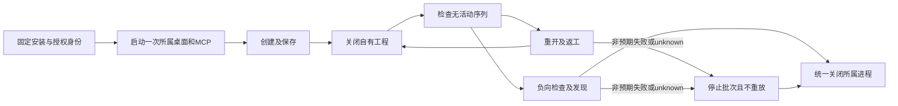

# 固定76连续所属实例验收

任务9.35：在既有固定76／源57安装副本上，将创建、保存、关闭自有工程、重开、局部返工、预期禁用拒绝与目录发现放到同一所属会话。三套驱动顺序运行，每个suite/mode只启动一个MCP；bridge同时只启动一个签名桌面。同一套验收全程PID保持不变，结束后统一清理。

| 驱动 | 计划数／模式 | 计划操作数／模式（含禁用拒绝） | bridge实例数 | bridge秒数 |
|---|---:|---:|---:|---:|
| 44条编辑／导航／选择／撤销重做 | 52 | 654 | 1 | 34.42 |
| 27条轨道目标／状态 | 33 | 178 | 1 | 10.08 |
| 15条只读查询 | 3 | 42 | 1 | 3.50 |

三套驱动使用独立、固定的授权输出根，所以分别拥有会话；不同时启动桌面。这里的操作数包含142项未发送编辑请求的禁用拒绝，不是完整命令可用率。86条有界观察仍不代表全部参数和适用上下文验收；580条在此证据集中仍只有发现。

各模式目录的 `session.json` 记录实际PID、阶段命令、启动次数、固定身份摘要、耗时和清理。`reset-observations.json` 绑定每个公开重置回执摘要，并断言 `active_sequence=null`。语义观察记录工程、局部修订、非目标与输入摘要保全；完整原始工程和逐步回执保留在私有目录。

每阶段仍使用安装副本的 `commands.execute`；仅会话所有者管理生命周期。权限／模式／运行时／保护根／模型目录／安装合同变化拒绝借用；运行时二进制摘要每阶段核对。外部输入必须预先列入保护根；批次内生成的工程位于授权写根，采用输入复制及摘要保全，不声称原路径有OS只读保护。未知结果、进程退出和非预期失败停止整批，不重启、不重放。

初始连续44候选执行期间辅助脚本有演进，因此保留其私有原记录而不作为最终代码证据。最终三套驱动绑定从开始到结束未变化的辅助脚本摘要。三项缺接口红灯转四项目标测试通过，Python95通过；Node185通过、3项环境NOT_RUN。完整V1七项门禁保持开放。

此项是QA驱动改造，位于main，未修改不可变发布ZIP、技能快照或公开单次run的清理合同；不声称新增通用交互会话API、GUI手势、创作质量或完整宿主／权限资格。

English: Task9.35 reuses one owned native session per suite/mode throughout creation, save, explicit project close, empty-state assertion, reopen, revision, expected refusals and discovery. Three suites run sequentially using fixed separate grants: six MCP processes and three signed bridge desktop processes in total, never concurrent desktops. Actual PIDs stay fixed and all owned processes stop at batch end. The continuous plans preserve source projects and non-target state. Identity/grant changes and unknown outcomes stop the batch without restart or replay. All86 bounded command observations are reverified;580 remain unobserved beyond discovery and seven full V1 tasks stay open. This is a QA-only lifecycle change outside the frozen ZIP, with no new public interactive-session claim.
