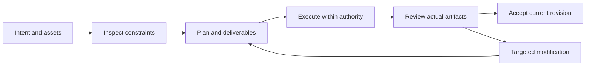

# FilmCraft V1 — 功能与界面规划

> **文档说明**：V1 实施阅读视图；规范事实源为 OpenSpec。
>
> **版本**：1.0.0
> **最后更新**：2026-10-05
> **状态**：目标设计；尚未实现。事实依据与验收结果单独标注。

关联文档：[品牌边界](../1%E3%80%81FilmCraft-%E5%91%BD%E5%90%8D%E4%B8%8E%E5%93%81%E7%89%8C%E8%AF%B4%E6%98%8E.md) · [技术方案](../5%E3%80%81FilmCraft-%E6%8A%80%E6%9C%AF%E6%96%B9%E6%A1%88%E4%B8%8E%E8%B7%AF%E7%BA%BF.md) · [详细架构](../../../docs/FilmCraft-Runtime-Architecture.zh_CN.md) · [OpenSpec](../../../openspec/changes/establish-v1-plugin/proposal.md) · [证据](../../../docs/evidence/runtime-baseline.json)

## 1. V1 功能模块

| 能力 | 行为边界 | 状态 |
| :--- | :--- | :--- |
| 素材导入与关联 | 登记视频、图片和音频的哈希、流信息、时长与引用，导入前检查缺失文件；素材移动后以哈希验证重关联。 | 计划中 |
| 精确时间线编排 | 使用整数 ticks 与有理数时间基准记录入出点、轨道和片段顺序；JSON 中的大整数使用十进制字符串；拒绝越界片段。 | 计划中 |
| 音画与配音组织 | 保持配音、音乐、原始音轨的独立身份与增益；验证输出音轨存在及同步；没有授权时不生成或上传声音。 | 计划中 |
| 字幕时间与版式 | 保存字幕文本、语言、起止时间及样式；拒绝时间越界；缺少字体时报告替代影响，不悄悄更换。 | 计划中 |
| 工程保存与局部修订 | 保存 .fcproj、重新打开并核对时间线；根据稳定片段 ID 修改单镜头，保留其他轨道与素材引用。 | 计划中 |
| 预览与正式输出 | 区分代理预览与原生导出；正式输出必须解码验证尺寸、帧率、时长和音轨；不把 FFmpeg 替代输出标为原生导出。 | 计划中 |

## 2. 宿主流程

## 3. 界面载体与责任

宿主展示计划卡、任务状态、预览与交付链接；原生编辑器承担精细人工编辑。诊断 JSON 供维护者读取，用户默认看到问题含义、影响范围与可执行恢复动作。

## 4. 异常状态

无素材显示缺失清单；无能力显示不支持项；执行中显示真实进度或未知进度；取消待确认保留占用；验收失败展示失败门禁与证据；不显示伪造百分比。

---

**文档版本**：1.0.0
**创建日期**：2026-10-05
**最后更新**：2026-10-05
**文档状态**：待评审；实现以 OpenSpec 任务和证据为准。
