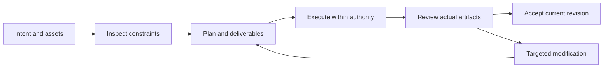

# FilmCraft V1 — Interaction-Plan

> **Purpose**: V1 implementation reading view; OpenSpec is normative.
>
> **Version**: 1.0.0
> **Updated**: 2026-10-05
> **Status**: Target design, not implemented. Observations and acceptance evidence are identified separately.

Related documents: [Brand boundary](../1%E3%80%81FilmCraft-Naming-and-Brand.md) · [Technical plan](../5%E3%80%81FilmCraft-Technical-Plan.md) · [Detailed architecture](../../../../docs/FilmCraft-Runtime-Architecture.md) · [OpenSpec](../../../../openspec/changes/establish-v1-plugin/proposal.md) · [Evidence](../../../../docs/evidence/runtime-baseline.json)

## 1. V1 functional modules

| Capability | Behavioral boundary | Status |
| :--- | :--- | :--- |
| Media import and relinking | Register hashes, streams, duration and references for video, images and audio; detect missing files before import and verify hashes when relinking moved assets. | Planned |
| Exact timeline assembly | Represent in/out points, tracks and ordering with integer ticks and rational timebases; serialize large integers as decimal strings and reject out-of-range clips. | Planned |
| Audio and voice-over assembly | Preserve separate identities and gains for voice-over, music and source audio; verify output audio and sync; do not synthesize or upload voices without authorization. | Planned |
| Caption timing and layout | Preserve caption text, language, time ranges and style; reject invalid timing and report font substitution impacts instead of changing fonts silently. | Planned |
| Project round-trip and local revision | Save and reopen .fcproj, inspect the timeline and revise one shot by stable clip ID without changing other tracks or asset references. | Planned |
| Preview and final output | Separate proxy preview from native export; decode final outputs and verify dimensions, frame rate, duration and audio; never label an FFmpeg substitute as native export. | Planned |

## 2. Host journey

## 3. Surfaces and responsibilities

The host presents plans, task states, previews and delivery links; native editors support detailed manual editing. Diagnostic JSON is for maintainers; users see the issue, affected scope and actionable recovery.

## 4. Exceptional states

Missing assets show a checklist; missing capabilities show unsupported operations; running tasks show real or explicitly unknown progress; pending cancellation retains occupancy; failed acceptance shows gates and evidence. Do not fabricate progress percentages.

---

**Document version**: 1.0.0
**Created**: 2026-10-05
**Updated**: 2026-10-05
**Document status**: Ready for review; implementation status is governed by OpenSpec tasks and evidence.
